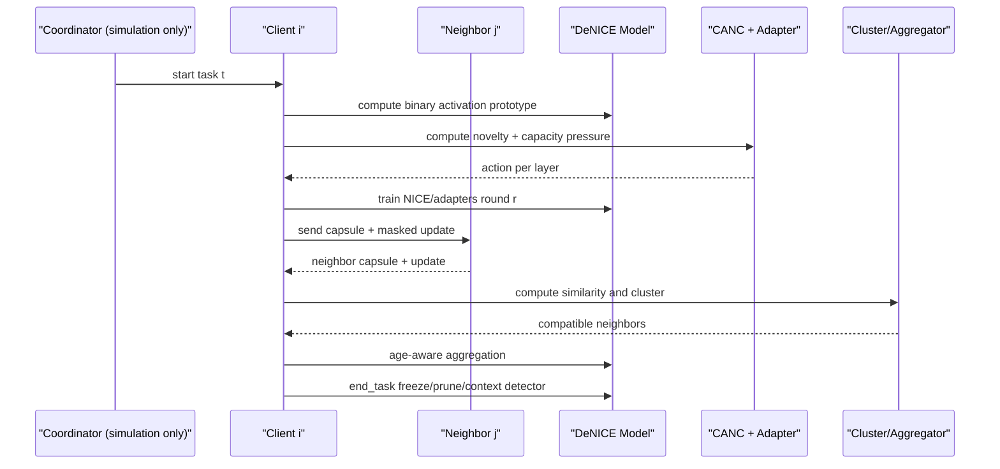

# Kế hoạch implementation DeNICE: NICE-DFL-IDS + Micro-Adapter

## 1. Phạm vi thiết kế

Kế hoạch này lấy toàn bộ ý tưởng chính từ `Đề xuất.md`:

- Local continual learning dựa trên NICE.
- NICE Context Capsule.
- Context-aware decentralized clustering.
- Age-aware decentralized aggregation.
- Capacity-Aware Neurogenesis Controller (CANC).
- Context-aware inference không cần task-id.

Từ `NERVA.md` chỉ lấy đúng một phần:

```text
Micro-adapter:
A_l(h) = U_l sigma(V_l h)
r_l = max(4, d_l / 16)
```

Không lấy recurrent mapping, tiny recurrent router, pseudo-feature correction, hay full NERVA.

Trong triển khai thật, hệ thống không có server trung tâm. Tuy nhiên trong repo có thể cần một `Runner/Coordinator` để mô phỏng round, lưu checkpoint và gọi client. Coordinator này không được aggregate toàn cục như FedAvg server; nó chỉ điều phối thí nghiệm.

## 2. Thành phần cần thêm vào repo

### 2.1. Model: NICE có micro-adapter

File đề xuất:

```text
fed_learning/models/denice_model.py
```

Kế thừa `NICEModel`, thêm adapter registry:

```text
adapter_id = (task_id, layer_name, rank)
```

Adapter dạng:

```text
A_l(h) = U_l sigma(V_l h)
V_l: d_l -> r_l
U_l: r_l -> d_l
r_l = max(4, d_l / 16)
```

Layer ưu tiên:

```text
fc1 -> gru -> conv3 -> conv2 -> conv1
```

MVP nên hỗ trợ trước:

```text
fc1, gru, conv3
```

Sau đó mới mở rộng `conv2`, `conv1`.

### 2.2. Capacity-Aware Neurogenesis Controller

File đề xuất:

```text
fed_learning/strategies/incremental/denice_capacity.py
```

Theo dõi từng layer:

```text
rho0_i,l = free_neurons / total_neurons
rhom_i,l = mature_neurons / total_neurons
u_i,l    = selected_learner_neurons / candidate_learner_neurons
nu_i,t   = novelty của task mới
dL_i,t   = validation loss tăng sau khi học task mới
```

Áp lực capacity:

```text
kappa_i,l,t =
  alpha * (1 - rho0_i,l)
+ beta  * u_i,l
+ gamma * dL_i,t
+ delta * nu_i,t
```

Action trả về:

```text
NICE_ONLY
HIGH_LAYER_ONLY
ADD_ADAPTER
EMERGENCY_LOW_ADAPTER
GRACEFUL_RECYCLING
```

### 2.3. Context Capsule

File đề xuất:

```text
fed_learning/strategies/decentralized/denice_capsule.py
```

Mỗi client gửi capsule cho neighbor:

```text
Psi_i^t = {
  activation_prototypes,
  age_mask,
  neuron_importance,
  reliability,
  context_detector_summary,
  capacity_histogram,
  label_histogram,
  sample_count,
  architecture_version,
  adapter_registry
}
```

Không gửi raw data.

### 2.4. Decentralized clustering

File đề xuất:

```text
fed_learning/strategies/decentralized/denice_clustering.py
```

Tính similarity giữa client `i` và neighbor `j`:

```text
s_ij =
  lambda1 * cos(P_i, P_j)
+ lambda2 * J(M_i, M_j)
+ lambda3 * O(Y_i, Y_j)
+ lambda4 * C(H_i, H_j)
+ lambda5 * R_j
- lambda6 * D(Delta_i, Delta_j)
```

Trong đó:

```text
P: activation prototype
M: age mask / selected-neuron mask
Y: label set
H: capacity histogram
R: reliability
D: update divergence / anomaly score
```

Tạo cụm cộng tác:

```text
G_i^t = {C_j | s_ij > delta_cluster}
```

MVP dùng threshold neighbor trực tiếp. Sau đó có thể thêm label propagation hoặc gossip community detection.

### 2.5. Age-aware decentralized aggregation

File đề xuất:

```text
fed_learning/strategies/decentralized/denice_aggregation.py
```

Trọng số neighbor:

```text
alpha_ij =
  s_ij * n_j * R_j
  / sum_k(s_ik * n_k * R_k)
```

Update:

```text
theta_i <- theta_i + eta * sum_j alpha_ij * (M_ij o Delta theta_j)
```

Aggregation mask `M_ij` chỉ bật khi:

- Tham số thuộc vùng plastic hoặc cùng context.
- Neuron age tương thích.
- Output label cùng semantic class.
- Activation prototype không lệch xa cụm.
- Update không sửa neuron mature của client khác.

Adapter aggregation:

```text
Chỉ aggregate adapter nếu:
adapter_id giống nhau
shape giống nhau
architecture_version tương thích
context cluster tương thích
```

Nếu client không có adapter đó:

```text
bỏ qua client đó trong adapter FedAvg
```

## 3. Rule CANC + micro-adapter

### Rule 1: NICE gốc

Nếu:

```text
rho0_i,l >= epsilon_free
and
kappa_i,l,t < kappa_mid
```

Thì:

```text
không thêm adapter
train NICE bình thường
```

### Rule 2: Chỉ học tầng cao

Nếu:

```text
rho0_i,l_low < epsilon_free
and
nu_i,t < xi_novelty
and
kappa_i,l_high,t < kappa_high
```

Thì:

```text
freeze conv1/conv2
chỉ học conv3/gru/fc1/fc2
không thêm adapter layer thấp
```

Ý nghĩa:

```text
early layer cạn nhưng task mới vẫn gần task cũ
-> dùng lại feature thấp
-> không phí adapter
```

### Rule 3: Thêm micro-adapter

Nếu:

```text
kappa_i,l,t >= kappa_adapter
```

hoặc:

```text
rho0_i,l < epsilon_adapter
and
(nu_i,t >= xi_novelty or dL_i,t >= xi_loss or u_i,l >= xi_consume)
```

Thì:

```text
tạo hoặc bật adapter A_l,t
```

Adapter:

```text
A_l(h) = U_l sigma(V_l h)
r_l = max(4, d_l / 16)
```

### Rule 4: Emergency adapter ở layer thấp

Nếu:

```text
rho0_i,l_low < epsilon_adapter
and
nu_i,t >= xi_high_novelty
and
dL_i,t >= xi_loss
```

Thì bật adapter theo thứ tự:

```text
fc1 -> gru -> conv3 -> conv2 -> conv1
```

`conv1/conv2` là fallback cuối vì thay đổi layer thấp dễ làm lệch toàn backbone.

### Rule 5: Graceful recycling

Chỉ dùng khi:

```text
rho0_i,l = 0
and adapter không đủ
and kiểm tra old validation/prototype an toàn
```

Neuron mature được đưa vào diện recycle nếu:

```text
I_old < eta1
usage_recent < eta2
DeltaF1_old < eta3
```

Không reset ngay. Đưa qua:

```text
age = -1  # retired
```

Sau vài round nếu không gây giảm old prototype/F1:

```text
age = 0
```

## 4. Cách tính novelty

Novelty đo task mới khác task cũ bao nhiêu.

Quy trình:

```text
1. Cho data task mới đi qua model.
2. Lấy activation conv1/conv2/conv3/gru.
3. Biến activation thành binary vector 548 chiều.
4. Lấy trung bình các vector -> prototype P_new.
5. So P_new với prototype cũ bằng cosine similarity.
6. novelty = 1 - max_similarity.
```

Ví dụ:

```text
similarity = 0.90 -> novelty = 0.10 -> task giống task cũ
similarity = 0.45 -> novelty = 0.55 -> task khác mạnh
```

## 5. Mã giả tổng thể

### 5.1. Coordinator mô phỏng decentralized training

```text
Input:
  clients C_1...C_K
  task stream t = 0...5
  communication graph G_t
  rounds_per_task = n

For task t in 0..5:
  Coordinator load local task data D_i^t cho từng client
  Coordinator broadcast task metadata: task_id, seen_classes, label_registry

  For each client C_i:
    C_i.prepare_task(t)
    C_i.compute_novelty()
    C_i.run_CANC()
    C_i.activate_neurons_or_adapters()

  For round r in 1..n:
    For each client C_i in parallel:
      C_i.local_train_one_round(r)
      C_i.build_context_capsule()
      C_i.send capsule + masked update to neighbors

    For each client C_i:
      C_i.receive neighbor capsules
      C_i.compute_context_similarity()
      C_i.form_decentralized_cluster()
      C_i.age_aware_aggregate()

    Save round checkpoint for each client/global simulation state

  For each client C_i:
    C_i.end_task()
    C_i.update_context_detector()
    C_i.save_task_checkpoint()
```

### 5.2. Client local training

```text
Client.prepare_task(t):
  Load D_i^t
  Update seen_classes_i
  Compute class/task metadata
  Mark new output neurons as learner
  Build current capacity histogram

Client.compute_novelty():
  X_ref <- sample subset of D_i^t
  B_new <- binary_context_activation(X_ref)
  P_new <- mean(B_new)
  sim_best <- max_e cosine(P_new, P_i^e)
  novelty <- 1 - sim_best
  return novelty

Client.run_CANC():
  For each layer l:
    rho0 <- free_l / total_l
    rhom <- mature_l / total_l
    u <- selected_learner_l / candidate_learner_l
    kappa <- alpha*(1-rho0) + beta*u + gamma*dL + delta*novelty
    action_l <- decide_action(rho0, novelty, dL, u, kappa)
  return actions

Client.activate_neurons_or_adapters():
  If action_l == NICE_ONLY:
    activate age-0 neurons as NICE
  If action_l == HIGH_LAYER_ONLY:
    freeze low layers
    train high layers only
  If action_l == ADD_ADAPTER:
    create adapter A_l,t if missing
  If action_l == EMERGENCY_LOW_ADAPTER:
    create adapter by priority fc1 -> gru -> conv3 -> conv2 -> conv1
  If action_l == GRACEFUL_RECYCLING:
    mark candidate mature neurons as retired

Client.local_train_one_round(r):
  For each local batch:
    logits <- model.forward_with_active_adapters(x)
    loss <- CE over valid current/context labels
    backprop
    zero gradients for mature neurons
    optimizer.step()
  select_learner_units_by_activation()
  update local reliability metrics

Client.build_context_capsule():
  Compute activation prototypes
  Export age masks
  Export neuron importance
  Export capacity histogram
  Export reliability
  Export label histogram
  Export architecture_version and adapter_registry
  return capsule

Client.age_aware_aggregate():
  For each neighbor j in cluster:
    alpha_ij <- normalized(s_ij * n_j * R_j)
    mask_ij <- compatible_age_context_mask(i, j)
    theta_i <- theta_i + eta * alpha_ij * mask_ij * Delta_theta_j
  For each adapter_id:
    aggregate only matching adapter_id and shape

Client.end_task():
  learner neurons kept by activation -> mature
  unselected learner -> young/free
  retired neurons remain retired unless safe
  freeze mature neurons
  prune younger-to-older harmful connections
  update binary activation memory
  train/update context detector
```

## 6. Chi tiết task 0 -> task 5

Giả sử có 6 tasks:

```text
Task 0: classes 0..5
Task 1: classes 6..11
Task 2: classes 12..17
Task 3: classes 18..23
Task 4: classes 24..29
Task 5: classes 30..33
```

### Task 0

Mục tiêu:

```text
khởi tạo tri thức đầu tiên
chưa có old prototype để so novelty
không cần cluster context phức tạp
```

Client:

```text
nu = 1.0 hoặc undefined
CANC bỏ qua novelty vì chưa có task cũ
dùng NICE gốc
không thêm adapter trừ khi model quá nhỏ và loss không học được
train task 0
lưu activation prototype P_i^0
lưu context capsule đầu tiên
train context detector bước đầu
```

Aggregation:

```text
cluster có thể dựa trên label overlap + capacity + reliability
age-aware aggregation chỉ update plastic/new neurons
mature chưa nhiều nên risk thấp
```

### Task 1

Mục tiêu:

```text
so task mới với prototype task 0
kiểm tra early layer có cạn không
```

Client:

```text
compute P_i^1
nu = 1 - cosine(P_i^1, P_i^0)
run CANC
if early layer cạn nhưng nu thấp:
  Rule 2: học tầng cao
if nu cao hoặc loss xấu:
  Rule 3: thêm adapter fc1/gru
```

Aggregation:

```text
gửi capsule gồm P_i^1, age_mask, capacity_hist, adapter_registry
cluster neighbor theo context similarity
aggregate trong cụm
adapter chỉ aggregate nếu adapter_id giống nhau
```

### Task 2

Mục tiêu:

```text
GRU/fc1 có thể bắt đầu chịu áp lực
context detector đã có task 0 và 1
```

Client:

```text
P_i^2 <- binary activation prototype task 2
nu = 1 - max(cos(P_i^2, P_i^0), cos(P_i^2, P_i^1))
run CANC per layer
if rho0_fc1 thấp hoặc kappa_fc1 cao:
  add fc1 adapter
if rho0_gru thấp và novelty/loss cao:
  add gru adapter
```

Aggregation:

```text
cluster động có thể thay đổi so với task 1
protect mature neuron task 0/1
aggregate mostly plastic + compatible adapters
```

### Task 3

Mục tiêu:

```text
giảm nguy cơ hết capacity bằng adapter thay vì tiêu hết neuron
```

Client:

```text
P_i^3 <- prototype
nu = 1 - max_e cosine(P_i^3, P_i^e), e in {0,1,2}
if novelty thấp:
  reuse low-level mature features
  train high layers/adapters
if novelty cao:
  fc1 -> gru -> conv3 adapter priority
```

Aggregation:

```text
capsule similarity quyết định cụm
adapter registry giúp chỉ aggregate adapter cùng shape
mature weights không aggregate trừ khi cùng context rất mạnh
```

### Task 4

Mục tiêu:

```text
capacity pressure cao hơn
cluster và aggregation phải bảo vệ old task mạnh hơn
```

Client:

```text
P_i^4 <- prototype
run CANC
if adapter đã tồn tại:
  activate adapter phù hợp
if adapter chưa đủ:
  add adapter ở layer tiếp theo theo priority
avoid conv1/conv2 unless emergency
```

Aggregation:

```text
increase robustness: trimmed mean hoặc coordinate median nếu update lệch
use anomaly score D(Delta_i, Delta_j)
```

### Task 5

Mục tiêu:

```text
task cuối có ít class hơn nếu tổng 34 class
đánh giá final performance và capacity usage
```

Client:

```text
P_i^5 <- prototype
run CANC
if fc1/gru exhausted:
  activate existing adapters
  add conv3 adapter nếu novelty/loss cao
if still failing:
  graceful recycling only if old prototype check safe
end task:
  mature selected neurons
  freeze
  update final context detector
```

Aggregation:

```text
final decentralized cluster aggregation
save per-client final checkpoints
save capsule logs
save neuron usage and adapter usage summary
```

## 7. Chi tiết round trong mỗi task

Gọi mỗi task có `n` round. Mô tả các round cần log rõ: `1`, `2`, `n-1`, `n`.

### Round 1

Client:

```text
prepare task nếu round đầu
compute novelty
run CANC
activate neurons/adapters
train local one round
select learner neurons by activation
build capsule
send update + capsule to neighbors
```

Cluster/Aggregation:

```text
cluster dựa trên capsule mới nhất
aggregation conservative
ưu tiên plastic neurons
adapter aggregation nếu adapter_id khớp
```

Log bắt buộc:

```text
task_id, round_id
novelty
capacity per layer
CANC action per layer
adapter created/active
cluster size
route/context accuracy nếu eval
```

### Round 2

Client:

```text
train tiếp với action từ CANC
update activation importance
recompute reliability
build capsule mới
```

Cluster/Aggregation:

```text
cluster có thể ổn định hơn round 1
aggregation mask chặt hơn dựa trên age/context
```

Log bắt buộc:

```text
loss change from round 1
u_i,l consumption ratio
adapter gradient norm
neighbor similarity top-k
```

### Round n-1

Client:

```text
gần cuối task
không tạo adapter mới trừ emergency
ổn định learner set
đánh giá adapter có cần giữ không
```

Cluster/Aggregation:

```text
aggregation thận trọng
không cho update làm lệch mature neurons
```

Log bắt buộc:

```text
pre-final capacity
candidate neurons to mature
adapter active ratio
old prototype drift
```

### Round n

Client:

```text
train round cuối
final select learner neurons
end_task:
  selected learner -> mature
  unselected learner -> young
  freeze mature
  prune harmful connections
  update context memory
  train context detector
  save checkpoint
```

Cluster/Aggregation:

```text
final aggregation trong cụm cho task hiện tại
save final cluster/capsule snapshot
```

Log bắt buộc:

```text
task summary metrics
neuron usage per layer
adapter usage per layer
context detector route accuracy
cluster composition
checkpoint path
```

## 8. Pseudocode LaTeX cho paper

```latex
\begin{algorithm}[t]
\caption{DeNICE with Capacity-Aware Micro-Adapters}
\label{alg:denice}
\begin{algorithmic}[1]
\Require Clients $\mathcal{C}$, tasks $t=0,\ldots,5$, graph $G_t$, rounds $n$
\Ensure Personalized decentralized NICE models $\{f_i\}_{i=1}^{|\mathcal{C}|}$
\For{$t=0$ to $5$}
    \For{each client $C_i$ in parallel}
        \State Load local task data $D_i^t$
        \State Compute binary activation prototype $P_i^t$
        \State $\nu_i^t \gets 1 - \max_{e<t}\cos(P_i^t,P_i^e)$
        \State Compute layer capacity $\rho_{i,l}^0$, consumption $u_{i,l}^t$, pressure $\kappa_{i,l}^t$
        \State Decide CANC action for each layer
        \State Activate NICE neurons or instantiate micro-adapter $A_{l,t}(h)=U_{l,t}\sigma(V_{l,t}h)$
    \EndFor
    \For{$r=1$ to $n$}
        \For{each client $C_i$ in parallel}
            \State Train local NICE/adapters on $D_i^t$
            \State Select learner neurons by activation coverage
            \State Build context capsule $\Psi_i^t$
            \State Send masked update and capsule to neighbors in $G_t$
        \EndFor
        \For{each client $C_i$ in parallel}
            \State Compute context similarity $s_{ij}$ with neighbors
            \State Form decentralized collaboration set $\mathcal{G}_i^t$
            \State Aggregate compatible updates using age-aware mask $\mathcal{M}_{ij}^t$
            \State Aggregate adapters only when adapter id and shape match
        \EndFor
    \EndFor
    \For{each client $C_i$ in parallel}
        \State Mature selected learner neurons and freeze mature neurons
        \State Update binary activation memory and context detector
        \State Save checkpoint, capsule, neuron usage, adapter usage
    \EndFor
\EndFor
\State \Return $\{f_i\}$
\end{algorithmic}
\end{algorithm}
```

## 9. Mermaid sequence diagram



## 10. Output cần lưu

Mỗi task/round:

```text
checkpoint_task_{t}_round_{r}.pt
context_capsule_task_{t}_round_{r}.json
cluster_snapshot_task_{t}_round_{r}.json
adapter_registry_task_{t}_round_{r}.json
```

Mỗi task:

```text
nice_neuron_usage_summary.json
denice_adapter_usage_summary.json
context_detector_summary.json
```

Final:

```text
all_task_metrics.json
all_cluster_metrics.json
all_adapter_metrics.json
final_report.json
```

## 11. Ablation cần chạy

```text
1. NICE gốc
2. NICE + CANC không adapter
3. NICE + CANC + fc1 adapter
4. NICE + CANC + fc1/gru adapter
5. NICE + CANC + fc1/gru/conv3 adapter
6. Full DeNICE decentralized clustering + age-aware aggregation
```

Metrics:

```text
final accuracy
average incremental accuracy
forgetting
macro F1
route accuracy
cluster purity/proxy similarity
neuron depletion rate
adapter parameter count
active FLOPs
communication bytes
```

## 12. Implementation order khuyến nghị

```text
Step 1: CANC metrics + novelty prototype.
Step 2: Micro-adapter ở fc1.
Step 3: Adapter registry + checkpoint save/load.
Step 4: Context capsule.
Step 5: Decentralized clustering bằng threshold similarity.
Step 6: Age-aware aggregation mask.
Step 7: Adapter aggregation.
Step 8: GRU/conv3 adapter.
Step 9: Graceful recycling.
Step 10: Full logging + ablation.
```

Không nên làm ngay tất cả trong một commit. MVP tốt nhất:

```text
NICE + CANC + fc1 micro-adapter + capsule logging
```

Sau khi ổn mới thêm clustering và age-aware aggregation.
