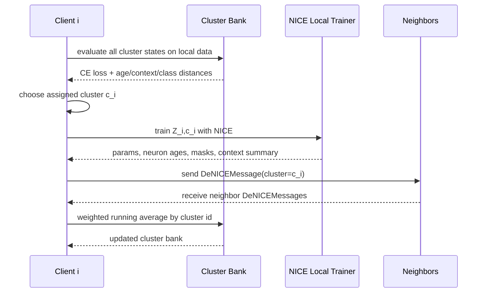
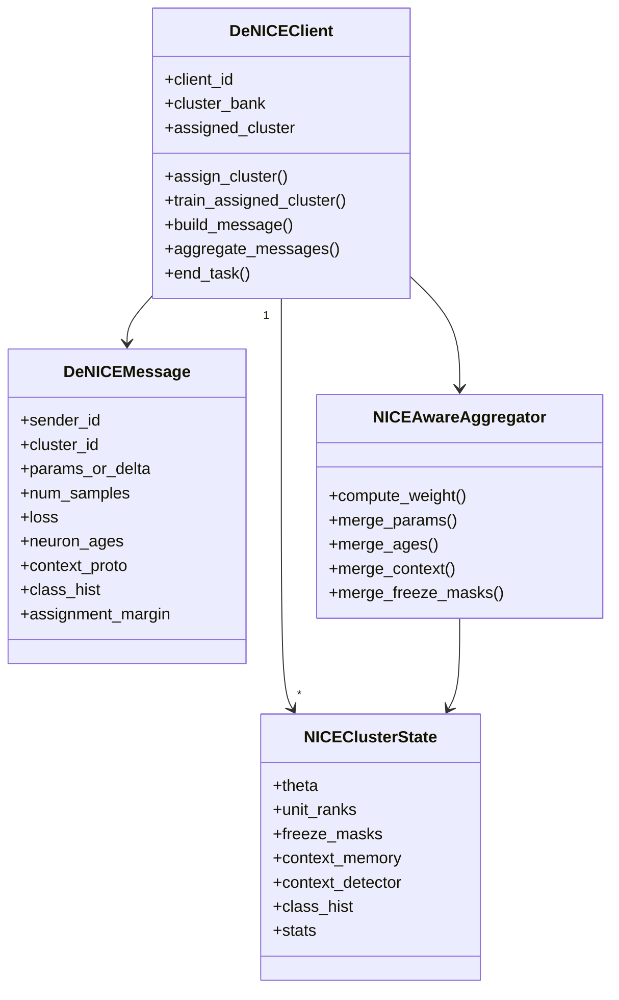

# DeNICE: Decentralized NICE Protocol

## 1. Mục tiêu

`DeNICE` là protocol mới kết hợp:

- `NICE`: replay-free class-incremental learning bằng neuron age, freeze mask, context detector.
- `DFCA`: decentralized federated clustering bằng local cluster bank, assign cluster, peer-to-peer running average.

Mục tiêu không phải chạy NICE trong FL có server, mà tạo một protocol:

```text
Không server trung tâm.
Mỗi client tự giữ nhiều NICE cluster states.
Mỗi client tự chọn cluster phù hợp với local task/data.
Mỗi client chỉ train cluster đã chọn.
Client gửi state/update cho neighbor.
Neighbor aggregate theo running average có trọng số.
Neuron age/context không chỉ để bảo vệ/eval, mà dùng trực tiếp cho cluster và aggregation.
```

Tên tạm:

```text
DeNICE = Decentralized Neurogenesis-Inspired Clustered Encoding
```

## 2. Bài toán

Có `N` client trong đồ thị truyền thông:

```text
G = (V, E), |V| = N
```

Client `i` chỉ giao tiếp với neighbor:

```text
N_i = {m | (i, m) in E}
```

Class-incremental setting có `T` task/episode. Ở task `t`, client `i` có dữ liệu local:

```text
D_i^t = {(x, y)}
```

Mỗi task mở thêm class mới:

```text
C_t = new classes at task t
S_t = all seen classes up to task t
```

Mục tiêu:

```text
Mỗi client học class mới, giữ tri thức class cũ, không giữ raw replay data, không dùng server.
```

## 3. Nền tảng NICE

NICE gốc là replay-free CIL. Ý chính:

1. Mỗi neuron có tuổi:

```text
age = 0  -> young, capacity dự trữ
age = 1  -> learner, đang học task hiện tại
age >= 2 -> mature, giữ tri thức cũ
```

2. Trong task mới, NICE chọn một tập learner neuron nhỏ nhất sao cho giữ đủ activation:

```text
min |S_1^l|
subject to sum activation(S_1^l) >= tau * total activation(age-1 neurons)
```

3. Mature neurons được bảo vệ:

```text
Không update incoming weights vào mature neurons.
Prune/freeze connection có thể làm mature neurons bị thay đổi bởi younger ancestors.
```

4. NICE không có task id khi inference. Nó dùng context detector:

```text
activation -> binary activation vector -> chained LogisticRegression -> predicted episode
```

5. Khi biết predicted episode, NICE chỉ cho phép class/age tương ứng tham gia argmax.

Trong code hiện tại:

- `NICEServer` giữ `global_model`, `context_detector`, `task_classes`, `seen_classes`.
- `ContextDetector` lưu binary activation memory theo episode và train chained logistic regression.
- `NICEAggregator` FedAvg params rồi restore frozen/mature params từ global model.
- Client gửi lên `params`, `num_samples`, `loss`, `neuron_ages`.

## 4. Nền tảng DFCA

DFCA gốc là decentralized federated clustering.

Mỗi client giữ `K` model cluster:

```text
theta_i,1, theta_i,2, ..., theta_i,K
```

Mỗi round gồm 3 bước:

```text
Step 1: AssignCluster
c_i = argmin_j F_client(theta_i,j, D_i)

Step 2: LocalUpdate
Client i chỉ train theta_i,c_i

Step 3: Decentralized Aggregation
Client i gửi theta_i,c_i cho neighbor.
Client nhận message rồi update cluster j bằng running average.
```

Running average DFCA:

```text
theta_i,j <- r/(r+1) * theta_i,j + 1/(r+1) * theta_m,j
```

Trong code hiện tại:

- `DFCAServer` chỉ orchestrate, không aggregate global model.
- `DFCANode` giữ `cluster_params`.
- `assign_cluster()` chọn cluster có local loss thấp nhất.
- `train_assigned_cluster()` train cluster đã chọn.
- `aggregate_received_messages()` chạy sequential running average.

## 5. Ý tưởng cốt lõi DeNICE

DFCA gốc chỉ cluster bằng local loss trên normal model.

DeNICE thay mỗi normal cluster model bằng một `NICEClusterState`:

```text
Z_i,j = {
  theta_i,j,              # NICE model params
  neuron_ages_i,j,        # unit_ranks per layer
  weight_masks_i,j,       # NICE masks
  bias_masks_i,j,
  freeze_masks_i,j,
  context_memory_i,j,
  context_detector_i,j,
  context_proto_i,j,
  class_hist_i,j,
  cluster_stats_i,j
}
```

Mỗi client `i` giữ `K_i^t` cluster states. `K_i^t` có thể cố định hoặc dynamic theo task.

DeNICE khác DFCA ở 3 điểm:

1. Cluster assignment dùng loss + NICE metadata.
2. Local update là NICE update, không phải SGD thường.
3. Aggregation dùng age/context/freeze-aware weighted running average.

## 6. State trên mỗi client

Client `i` giữ:

```text
ClientState_i = {
  client_id,
  task_id,
  seen_classes,
  local_class_hist,
  cluster_bank: {j -> NICEClusterState_i,j},
  assigned_cluster,
  neighbor_set,
  message_buffer,
  local_context_summary,
  local_age_summary
}
```

Mỗi cluster state giữ:

```text
NICEClusterState_i,j = {
  theta,
  unit_ranks,
  weight_masks,
  bias_masks,
  freeze_masks,
  bn_freeze_state,
  context_memory,
  context_thresholds,
  context_lr_weights,
  episode_classes,
  class_hist,
  n_samples_seen,
  last_loss,
  assignment_count,
  empty_rounds
}
```

## 7. Thông tin tận dụng từ NICE

DeNICE dùng toàn bộ thông tin NICE hiện có:

| Thông tin | NICE hiện tại dùng | DeNICE dùng thêm |
|---|---|---|
| `params` | aggregate | gửi/aggregate theo cluster |
| `num_samples` | FedAvg weight | sample weight |
| `loss` | log/debug | quality weight, assignment |
| `neuron_ages` | merge max, freeze | age similarity, age compatibility |
| `freeze_masks` | protect mature weights | protect khi peer aggregate |
| `learner_mask` | local training | cluster signature |
| `context activations` | route inference | context similarity |
| `context confidence` | debug/eval | aggregation confidence |
| `class_hist` | chưa dùng mạnh | assignment + dynamic cluster |
| `assignment_margin` | chưa có | reliability weight |

## 8. Client representation

Mỗi client tạo vector đại diện để cluster/weight:

```text
r_i = concat(
  normalize(delta_theta_summary_i),
  age_histogram_i,
  learner_ratio_i,
  mature_ratio_i,
  freeze_ratio_i,
  class_hist_i,
  context_proto_i,
  loss_i,
  log(num_samples_i)
)
```

Trong đó:

```text
delta_theta_summary_i = compressed(theta_i,c_i - theta_i,c_i_before)
age_histogram_i       = tỷ lệ young/learner/mature theo layer
context_proto_i       = mean binary activation hoặc mean context embedding
class_hist_i          = distribution class local
```

Không cần gửi full `r_i` nếu bandwidth thấp. Có thể gửi hash/summary:

```text
age_histogram + class_hist + context_proto + scalar stats
```

## 9. NICE-aware cluster assignment

DFCA gốc:

```text
c_i = argmin_j CE(theta_i,j, D_i)
```

DeNICE:

```text
score_i,j =
  CE(theta_i,j, D_i)
  + lambda_age   * d_age(A_i_local, A_i,j)
  + lambda_ctx   * d_ctx(Q_i_local, Q_i,j)
  + lambda_class * d_class(H_i_local, H_i,j)
  + lambda_cap   * cap_penalty(Z_i,j)
```

Client chọn:

```text
c_i = argmin_j score_i,j
```

Ý nghĩa:

- `CE`: cluster model nào dự đoán local data tốt nhất.
- `d_age`: cluster nào có age pattern hợp với client.
- `d_ctx`: cluster nào có context activation giống local data.
- `d_class`: cluster nào đã học class gần giống local class distribution.
- `cap_penalty`: cluster nào gần hết young neuron thì bị penalty.

Ví dụ distance:

```text
d_age   = 1 - cosine(age_hist_local, age_hist_cluster)
d_ctx   = 1 - cosine(context_proto_local, context_proto_cluster)
d_class = JS_divergence(class_hist_local, class_hist_cluster)
```

Assignment confidence:

```text
margin_i = score_second_best - score_best
conf_assign_i = sigmoid(margin_i / temperature)
```

Nếu margin nhỏ, client không chắc cluster. Message của client đó nên có trọng số thấp hơn.

## 10. NICE local update trong DeNICE

Sau khi chọn cluster `c_i`, client chỉ train:

```text
Z_i,c_i
```

Không train các cluster khác.

Local update gồm:

1. Set class mới thành learner ở output layer.
2. Load `theta`, `unit_ranks`, masks, freeze masks của cluster.
3. Train phase NICE:

```text
for phase p = 1..P:
  train local epoch with LetLearner and freeze masks
  compute activations
  select active learner neurons
  drop unused learner neurons back to young
```

4. Update context memory bằng train samples, không dùng test data.
5. Train/update context detector cho cluster.
6. Cuối task, increase unit ranks:

```text
learner -> mature
young stays young
```

7. Update freeze masks.

## 11. Message format

Client gửi cho neighbor:

```text
DeNICEMessage = {
  sender_id,
  task_id,
  round_id,
  cluster_id,
  protocol_version,

  params_or_delta,
  num_samples,
  train_loss,

  neuron_ages,
  freeze_masks,
  learner_mask,
  class_hist,
  context_proto,
  context_confidence,
  assignment_score,
  assignment_margin,
  capacity_stats,

  optional: context_lr_weights,
  optional: context_thresholds,
  optional: compression_meta
}
```

Hai mode gửi model:

```text
Full-state mode:
  gửi theta_i,c_i

Delta mode:
  gửi delta_i,c_i = theta_i,c_i_after - theta_i,c_i_before
```

Khuyến nghị ban đầu: full-state mode để dễ đúng. Sau đó tối ưu delta/compression.

## 12. Weighted running average

DFCA gốc dùng weight đều theo thứ tự nhận message.

DeNICE dùng weighted running average:

```text
theta_i,j <- (W_i,j * theta_i,j + w_m * theta_m,j) / (W_i,j + w_m)
W_i,j     <- W_i,j + w_m
```

Trọng số message:

```text
w_m =
  sample_weight
  * quality_weight
  * age_compatibility
  * context_compatibility
  * assignment_confidence
  * capacity_safety
```

Gợi ý công thức:

```text
sample_weight = num_samples_m / (num_samples_m + sample_scale)
quality_weight = exp(-loss_m / tau_loss)
age_compatibility = exp(-d_age(age_i,j, age_m) / tau_age)
context_compatibility = exp(-d_ctx(ctx_i,j, ctx_m) / tau_ctx)
assignment_confidence = sigmoid(margin_m / tau_margin)
capacity_safety = 1 - mature_conflict_rate
```

Chuẩn hóa:

```text
w_m <- clamp(w_m, w_min, w_max)
```

## 13. Merge neuron ages

NICE hiện tại merge age bằng max:

```text
age <- max(age_local, age_peer)
```

DeNICE vẫn dùng rule này mặc định vì conservative:

```text
age_i,j[l] <- max(age_i,j[l], age_m[l])
```

Lý do:

- Nếu peer đã coi neuron là mature, local không nên kéo nó trẻ lại.
- Max age bảo vệ tri thức cũ.

Nhưng cần thêm conflict check:

```text
if peer updates many mature neurons:
  downweight peer update
```

Mature conflict rate:

```text
mature_conflict =
  || delta_theta on local mature mask || / || delta_theta ||
```

## 14. Merge freeze masks

Freeze mask merge:

```text
freeze_i,j <- freeze_i,j OR freeze_m
```

Hoặc theo age:

```text
freeze_i,j = (age_i,j >= 2)
```

Khuyến nghị:

```text
age là source of truth.
freeze mask sinh lại từ age sau merge.
```

## 15. Merge context

Context detector gốc dùng activation memory và chained LR.

DeNICE không nên gửi raw samples. Có 3 level:

### Level 1: Context prototype

Gửi:

```text
context_proto = mean(binary_activation_vectors)
context_count
```

Merge:

```text
proto <- (n_old * proto_old + n_msg * proto_msg) / (n_old + n_msg)
```

Nhanh, ít bandwidth.

### Level 2: Context memory sketch

Gửi một số binary activation vectors đã chọn:

```text
top_m binary activations per class/episode
```

Giống NICE memory nhưng không raw data.

### Level 3: Context LR weights

Gửi:

```text
coef_, intercept_ của logistic regression theo episode
```

Merge bằng weighted average nếu cùng shape và cùng episode map.

Khuyến nghị triển khai đầu:

```text
Level 1 + local retrain context detector.
```

Sau đó thử Level 2 nếu route accuracy thấp.

## 16. Dynamic cluster

Cluster không nên fix cứng.

Mỗi client có thể có:

```text
K_min <= K_i^t <= K_max
```

Tạo cluster mới khi:

```text
min_j score_i,j > create_threshold
hoặc assignment_margin < low_conf_threshold trong nhiều round
hoặc class_hist/context quá khác mọi cluster
```

Split cluster khi:

```text
cluster_variance_j > split_threshold
và assignment_count_j đủ lớn
```

Merge cluster khi:

```text
d_cluster(a, b) < merge_threshold
```

Xóa cluster khi:

```text
empty_rounds_j > patience
và cluster không chứa class/new context quan trọng
```

Cluster distance:

```text
d_cluster(a,b) =
  alpha_age * d_age(a,b)
  + alpha_ctx * d_ctx(a,b)
  + alpha_class * d_class(a,b)
  + alpha_weight * d_weight(a,b)
```

## 17. Task flow

Ở đầu task `t`:

```text
for each client i:
  update seen_classes S_t
  mark output neurons of new classes C_t as learner
  update local class_hist
  optionally create new cluster if no cluster can represent C_t
```

Trong mỗi round:

```text
1. AssignCluster
2. NICE LocalUpdate on assigned cluster
3. Build DeNICEMessage
4. Send message to neighbors
5. Receive neighbor messages
6. Weighted NICE-aware running average
7. Update cluster stats
```

Cuối task:

```text
1. Update context memory
2. Train context detector
3. Increase neuron ages
4. Rebuild freeze masks
5. Dynamic split/merge/create/remove cluster
6. Save continuation state if phase split
```

## 18. Round pseudocode

```latex
\begin{algorithm}[t]
\caption{DeNICE Round at Client $i$}
\label{alg:denice-round}
\begin{algorithmic}[1]
\Require Local data $D_i^t$, cluster bank $\{Z_{i,j}\}_{j=1}^{K_i}$, neighbors $\mathcal{N}_i$
\Ensure Updated cluster bank $\{Z_{i,j}\}_{j=1}^{K_i}$
\State $h_i \gets \textsc{ClassHistogram}(D_i^t)$
\State $q_i \gets \textsc{ContextPrototype}(D_i^t)$
\For{$j = 1$ to $K_i$}
  \State $\ell_{i,j} \gets \textsc{EvaluateLoss}(Z_{i,j}.\theta, D_i^t)$
  \State $a_{i,j} \gets d_{\text{age}}(Z_{i,j}, D_i^t)$
  \State $c_{i,j} \gets d_{\text{ctx}}(Z_{i,j}.q, q_i)$
  \State $b_{i,j} \gets d_{\text{class}}(Z_{i,j}.h, h_i)$
  \State $s_{i,j} \gets \ell_{i,j} + \lambda_a a_{i,j} + \lambda_c c_{i,j} + \lambda_h b_{i,j}$
\EndFor
\State $c_i \gets \arg\min_j s_{i,j}$
\State $m_i \gets \textsc{AssignmentMargin}(\{s_{i,j}\})$
\State $Z_{i,c_i} \gets \textsc{NICETrain}(Z_{i,c_i}, D_i^t)$
\State $M_i \gets \textsc{BuildMessage}(Z_{i,c_i}, c_i, m_i)$
\State send $M_i$ to all $m \in \mathcal{N}_i$
\ForAll{received message $M_m$}
  \State $j \gets M_m.cluster\_id$
  \State $w_m \gets \textsc{NICEAwareWeight}(Z_{i,j}, M_m)$
  \State $Z_{i,j} \gets \textsc{WeightedRunningAverage}(Z_{i,j}, M_m, w_m)$
\EndFor
\State \Return $\{Z_{i,j}\}_{j=1}^{K_i}$
\end{algorithmic}
\end{algorithm}
```

## 19. End-task pseudocode

```latex
\begin{algorithm}[t]
\caption{DeNICE End Task at Client $i$}
\label{alg:denice-end-task}
\begin{algorithmic}[1]
\Require Cluster bank $\{Z_{i,j}\}$, new classes $C_t$
\Ensure Matured and reorganized cluster bank
\For{$j = 1$ to $K_i$}
  \State $Z_{i,j}.context \gets \textsc{UpdateContextMemory}(Z_{i,j})$
  \State $Z_{i,j}.detector \gets \textsc{TrainContextDetector}(Z_{i,j}.context)$
  \State $Z_{i,j}.unit\_ranks \gets \textsc{IncreaseUnitRanks}(Z_{i,j}.unit\_ranks)$
  \State $Z_{i,j}.freeze\_masks \gets \textsc{BuildFreezeMasks}(Z_{i,j}.unit\_ranks)$
\EndFor
\State $\{Z_{i,j}\} \gets \textsc{DynamicClusterMaintenance}(\{Z_{i,j}\})$
\State \Return $\{Z_{i,j}\}$
\end{algorithmic}
\end{algorithm}
```

## 20. Mermaid flow



## 21. Mermaid class diagram



## 22. Ví dụ round

Giả sử:

```text
Client 17 đang ở task 2.
Seen classes = 0..17.
New classes task 2 = 12..17.
Client có K=3 clusters: c0, c1, c2.
```

Client tính:

```text
score(c0) = 1.42
score(c1) = 0.83
score(c2) = 0.91
```

Chọn:

```text
assigned_cluster = c1
margin = 0.91 - 0.83 = 0.08
```

Margin nhỏ nghĩa là client chưa chắc. Khi gửi update, `assignment_confidence` thấp.

Message:

```json
{
  "sender_id": 17,
  "task_id": 2,
  "round_id": 8,
  "cluster_id": 1,
  "num_samples": 18432,
  "train_loss": 0.19,
  "assignment_margin": 0.08,
  "context_confidence": 0.74,
  "class_hist": {"12": 0.4, "13": 0.6},
  "neuron_age_summary": {
    "conv1": {"young": 0, "learner": 3, "mature": 61},
    "fc1": {"young": 120, "learner": 30, "mature": 106},
    "fc2": {"young": 16, "learner": 6, "mature": 12}
  }
}
```

Neighbor nhận message cluster `1`, chỉ update local `Z_neighbor,1`.

Nếu neighbor thấy age pattern không hợp:

```text
age_compatibility thấp -> w_m thấp -> update nhẹ
```

Nếu loss thấp, sample nhiều, context confidence cao:

```text
w_m cao -> update mạnh
```

## 23. Evaluation

Có 3 kiểu eval:

### 23.1 Local client eval

Mỗi client eval bằng cluster đã assign:

```text
y_hat = NICEPredict(Z_i,c_i, x)
```

### 23.2 Context-routed cluster eval

Client không biết cluster của test sample. Nó route theo:

```text
cluster_score_j(x) =
  context_confidence_j(x)
  - loss_proxy_j(x)
  - class_mismatch_j(x)
```

Sau đó:

```text
j* = argmax_j cluster_score_j(x)
y_hat = NICEPredict(Z_i,j*, x)
```

### 23.3 Representative eval for paper

Để báo cáo giống FL-IL hiện tại, có thể build representative cluster models:

```text
rep_j = average cluster j across sampled clients
```

Sau đó evaluate:

```text
ensemble probability = average softmax(rep_j(x)) over active clusters
```

Nhưng cần ghi rõ:

```text
Representative eval chỉ để đo metric tập trung.
Protocol thực tế vẫn decentralized.
```

## 24. Metrics

Metric giống Fed-IL:

```text
Accuracy
Macro-F1
Macro-Precision
Macro-Recall
Weighted-F1
Per-task accuracy
Average Incremental Accuracy
```

Metric riêng DeNICE:

```text
Route accuracy of context detector
Cluster assignment entropy
Cluster switch rate
Cluster purity by class histogram
Mature conflict rate
Age compatibility score
Message count per round
Bytes transmitted per round
Neighbor coverage
Dynamic cluster count K_t
```

Nếu không tính AF để tiết kiệm training:

```text
Không chạy AF trong training loop.
Chỉ tính forgetting offline sau khi có checkpoints nếu cần.
```

## 25. Complexity

Với:

```text
N = số client
K = số cluster/client
E = local epochs
B = số batch local
P = số neighbor trung bình
|theta| = số params model
```

Per client per round:

```text
Assignment: O(K * B_assign * forward)
Local NICE train: O(E * B * forward/backward)
Message send: O(P * |message|)
Aggregation: O(num_received * |theta|)
```

Memory per client:

```text
O(K * |NICE state|)
```

Nặng hơn NICE/FedAvg vì giữ nhiều cluster states.

Giảm cost bằng:

```text
K nhỏ ở đầu.
Dynamic K.
Assignment dùng subset local data.
Message gửi delta/compressed params.
Context gửi prototype thay vì full memory.
Plexus sampling cho neighbor subset nếu graph dày.
```

## 26. Mapping với code hiện tại

Code có thể tái dùng:

| Thành phần | File hiện tại | Dùng cho DeNICE |
|---|---|---|
| NICE model/state | `fed_learning/models/nice_model.py` | cluster model |
| NICE context detector | `fed_learning/servers/nice_server.py` | context per cluster |
| NICE local training | `fed_learning/training/nice_worker.py`, `clients/nice_client.py` | local update |
| NICE aggregation/freeze restore | `fed_learning/strategies/fed_incremental/nice.py` | merge params/mature protection |
| DFCA node | `fed_learning/dfca/client.py` | client cluster bank skeleton |
| DFCA server simulator | `fed_learning/servers/dfca_server.py` | experiment orchestration |
| DFCA runner/checkpoint | `fed_learning/dfca/runner.py` | decentralized simulation + resume |
| FL-IL task loop | `fed_learning/training/task_loop.py` | task scheduling/eval/checkpoint |
| Plexus decentralized IL | `fed_learning/training/decentralized_plexus_il.py` | phase resume/output style |

Code cần thêm:

```text
fed_learning/denice/state.py
fed_learning/denice/client.py
fed_learning/denice/aggregator.py
fed_learning/denice/messages.py
fed_learning/denice/runner.py
fed_learning/denice/evaluation.py
fed_learning/training/decentralized_denice_il.py
tests/test_denice.py
```

## 27. Implementation stages

### Stage 1: Minimal DeNICE

Mục tiêu: chạy đúng end-to-end.

```text
K fixed.
Assignment = CE loss only.
Local update = NICE.
Message = full params + neuron_ages + num_samples + loss.
Aggregation = DFCA running average + NICE age max + freeze restore.
Context detector local only.
```

Output:

```text
results.json
round_metrics.json
task_metrics.json
checkpoint_task_X.pt
continuation_state_task_X.pt
```

### Stage 2: NICE-aware assignment

Thêm:

```text
age distance
class_hist distance
context_proto distance
assignment margin
```

### Stage 3: NICE-aware weighted aggregation

Thêm:

```text
sample_weight
quality_weight
age_compatibility
context_compatibility
assignment_confidence
mature_conflict penalty
```

### Stage 4: Dynamic cluster

Thêm:

```text
create/split/merge/remove cluster
cluster count metrics
cluster purity metrics
```

### Stage 5: GPU context routing optimization

Thêm:

```text
export sklearn LR weights to torch
context predict on GPU
vectorized class mask
```

## 28. Config đề xuất

```python
CONFIG = {
    "mode": "decentralized",
    "algorithm": "denice",
    "rounds_per_task": 20,
    "local_epochs": 1,
    "batch_size": 4096,
    "eval_batch_size": 8192,
    "eval_every": 20,

    "denice_num_clusters": 4,
    "denice_dynamic_clusters": True,
    "denice_max_clusters": 12,
    "denice_assignment_subset": 4096,
    "denice_message_mode": "full",
    "denice_context_level": "prototype",

    "lambda_age": 0.1,
    "lambda_ctx": 0.1,
    "lambda_class": 0.1,
    "lambda_capacity": 0.05,

    "tau_loss": 1.0,
    "tau_age": 1.0,
    "tau_ctx": 1.0,
    "tau_margin": 0.1,

    "nice_max_phases": 20,
    "nice_phase_epochs": 1,
    "nice_context_eval": True,
    "nice_debug_context_detector": False
}
```

## 29. Điểm mới để viết paper

Novelty chính:

```text
Một protocol decentralized clustered continual learning dùng neuron age và context state của NICE làm tín hiệu cluster + aggregation.
```

Khác NICE:

```text
NICE bảo vệ neuron và route context trong một learner tập trung.
DeNICE biến age/context thành state trao đổi giữa clients và dùng cho decentralized clustering.
```

Khác DFCA:

```text
DFCA cluster normal models bằng local loss.
DeNICE cluster NICE states bằng loss + neuron age + context + class distribution, hỗ trợ class-incremental learning.
```

Khác Plexus-NICE:

```text
Plexus-NICE chủ yếu là peer sampling/temporary aggregator.
DeNICE có cluster bank thật trên mỗi client và không cần aggregator trung tâm mỗi round.
```

## 30. Rủi ro

### Rủi ro 1: Memory cao

Mỗi client giữ `K` NICE states.

Fix:

```text
K nhỏ.
Share frozen mature backbone giữa clusters.
Only duplicate classifier/head + masks.
Compress old clusters.
```

### Rủi ro 2: Assignment tốn thời gian

Phải eval `K` cluster models.

Fix:

```text
assignment subset.
cache local representations.
two-stage assignment: cheap metadata shortlist -> CE loss final.
```

### Rủi ro 3: Context detector CPU chậm

Hiện NICE dùng sklearn LR CPU.

Fix:

```text
export LR weights to torch GPU for inference.
vectorize context mask.
```

### Rủi ro 4: Cluster collapse

Tất cả client chọn một cluster.

Fix:

```text
entropy regularization.
capacity penalty.
split high-variance cluster.
temperature on score.
```

### Rủi ro 5: Age over-freezing

Max age merge quá conservative làm hết capacity sớm.

Fix:

```text
merge age max chỉ trong compatible clusters.
downweight incompatible peer.
allow graceful forgetting/rejuvenation cho cluster ít dùng.
```

## 31. Thí nghiệm cần chạy

Baselines:

```text
FedAvg-IL
CGoFed
Fed-NICE
DFCA
Plexus
Plexus-IL
Plexus-NICE nếu dùng
```

Ablation:

```text
DeNICE-loss-only
DeNICE + age assignment
DeNICE + context assignment
DeNICE + class histogram
DeNICE + weighted aggregation
DeNICE + dynamic cluster
```

Metrics:

```text
Accuracy / Macro-F1 theo task
Communication bytes
Training time
Cluster purity
Cluster switch rate
Context route accuracy
Mature conflict rate
```

## 32. Kết luận thiết kế

Protocol nên chốt theo hướng:

```text
DFCA là skeleton decentralized clustering.
NICE là local continual learner.
Age/context/class/loss là metadata để cluster và aggregate.
Plexus chỉ optional để sample neighbors khi cần scale.
```

Phiên bản đầu nên làm đơn giản:

```text
Fixed K.
CE-loss assignment.
NICE local training.
Age max merge.
Freeze restore.
No AF during training.
Eval cuối task.
```

Sau khi có số đầu, mới bật:

```text
NICE-aware assignment.
Weighted aggregation.
Dynamic clusters.
GPU context inference.
```
