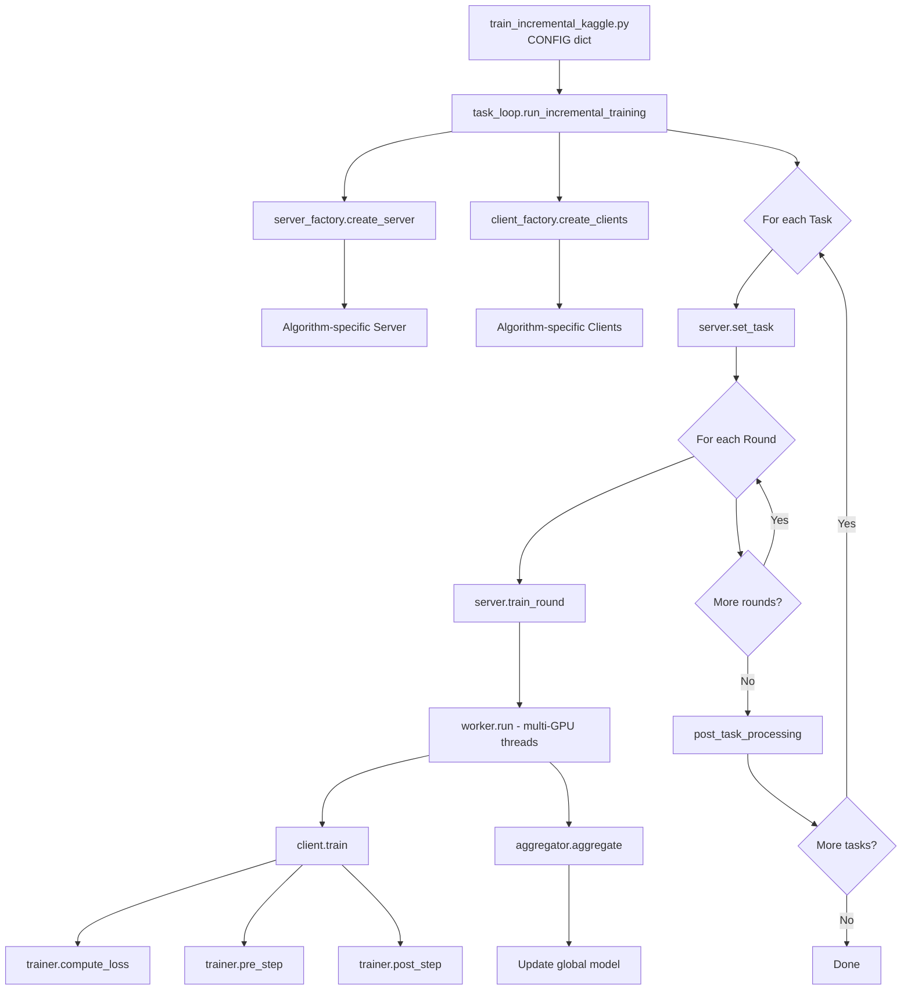
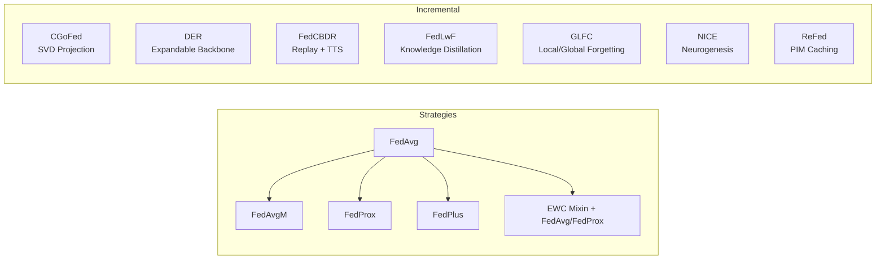

# BÁO CÁO KIỂM TRA NGHIÊN CỨU-MÃ NGUỒN (Research-Code Audit)
## Dự án: AI4FIDS — Federated Class-Incremental Learning for Intrusion Detection

---

## MỤC LỤC

1. [Tổng quan kiến trúc](#1-tổng-quan-kiến-trúc)
2. [Bảng ánh xạ Paper → Code](#2-bảng-ánh-xạ-paper--code)
3. [Kiểm tra chi tiết từng thuật toán](#3-kiểm-tra-chi-tiết-từng-thuật-toán)
   - 3.1 [FedAvg](#31-fedavg)
   - 3.2 [FedAvgM](#32-fedavgm)
   - 3.3 [FedProx](#33-fedprox)
   - 3.4 [FedPlus](#34-fedplus)
   - 3.5 [EWC](#35-ewc)
   - 3.6 [FedLwF](#36-fedlwf)
   - 3.7 [CGoFed](#37-cgofed)
   - 3.8 [DER](#38-der)
   - 3.9 [FedCBDR](#39-fedcbdr)
   - 3.10 [GLFC](#310-glfc)
   - 3.11 [NICE](#311-nice)
   - 3.12 [ReFed](#312-refed)
4. [Bảng tổng hợp điểm trung thực](#4-bảng-tổng-hợp-điểm-trung-thực)
5. [Danh sách TODO ưu tiên](#5-danh-sách-todo-ưu-tiên)

---

## 1. Tổng quan kiến trúc

### 1.1 Luồng thực thi chính

```
train_incremental_kaggle.py (CONFIG dict)
  → task_loop.run_incremental_training()
    → server_factory.create_server() → server instance (per-algorithm)
    → client_factory.create_clients() → client instances (per-algorithm)
    → For each task:
        → server.set_task()
        → For each round:
            → server.train_round()
              → worker.run() [multi-GPU threads]
                → client.train(trainer=...) 
                  → trainer.compute_loss() / pre_step() / post_step()
              → aggregator.aggregate(results)
        → post_task_processing()
```

### 1.2 Strategy Pattern

Mọi thuật toán đều kế thừa từ [`BaseTrainer`](fed_learning/core/trainer.py:13) và [`BaseAggregator`](fed_learning/core/aggregator.py:12) thông qua các hook:

| Hook | Mô tả |
|------|-------|
| [`compute_loss()`](fed_learning/core/trainer.py:26) | Tính loss chính + regularization |
| [`pre_step()`](fed_learning/core/trainer.py:52) | Can thiệp gradient trước optimizer.step() |
| [`post_step()`](fed_learning/core/trainer.py:73) | Can thiệp weight sau optimizer.step() |
| [`pre_train()`](fed_learning/core/trainer.py:92) | Khởi tạo trước vòng lặp training |
| [`post_train()`](fed_learning/core/trainer.py:110) | Dọn dẹp sau training |
| [`aggregate()`](fed_learning/core/aggregator.py:26) | Tổng hợp model từ các client |

### 1.3 Mô hình cơ sở: CNN-GRU

[`CNN_GRU_Model`](fed_learning/models/cnn_gru.py:14): Conv1d×3 (64→128→256) + BatchNorm + MaxPool + GRU(hidden=100, 2 layers) + FC(concat→256) + FC(256→num_classes). Concat = CNN_flat + GRU_last_hidden.

---

## 2. Bảng ánh xạ Paper → Code

| Thuật toán | Paper (PDF) | Strategy | Client | Server | Worker | Model |
|------------|-------------|----------|--------|--------|--------|-------|
| FedAvg | `paper/Fedavg.pdf` | [`fedavg.py`](fed_learning/strategies/federated/fedavg.py:1) | [`client.py`](fed_learning/clients/client.py:1) | [`server.py`](fed_learning/servers/server.py:1) | [`worker.py`](fed_learning/training/worker.py:1) | [`cnn_gru.py`](fed_learning/models/cnn_gru.py:1) |
| FedAvgM | `paper/FedAvgM.pdf` | [`fedavgm.py`](fed_learning/strategies/federated/fedavgm.py:1) | [`client.py`](fed_learning/clients/client.py:1) | [`server.py`](fed_learning/servers/server.py:1) | [`worker.py`](fed_learning/training/worker.py:1) | [`cnn_gru.py`](fed_learning/models/cnn_gru.py:1) |
| FedProx | `paper/Fedprox.pdf` | [`fedprox.py`](fed_learning/strategies/federated/fedprox.py:1) | [`client.py`](fed_learning/clients/client.py:1) | [`server.py`](fed_learning/servers/server.py:1) | [`worker.py`](fed_learning/training/worker.py:1) | [`cnn_gru.py`](fed_learning/models/cnn_gru.py:1) |
| FedPlus | `paper/Fed+.pdf` | [`fedplus.py`](fed_learning/strategies/federated/fedplus.py:1) | [`client.py`](fed_learning/clients/client.py:1) | [`server.py`](fed_learning/servers/server.py:1) | [`worker.py`](fed_learning/training/worker.py:1) | [`cnn_gru.py`](fed_learning/models/cnn_gru.py:1) |
| EWC | `paper/EWC.pdf` | [`ewc.py`](fed_learning/strategies/incremental/ewc.py:1) | [`client.py`](fed_learning/clients/client.py:1) | [`incremental_server.py`](fed_learning/servers/incremental_server.py:1) | [`worker.py`](fed_learning/training/worker.py:1) | [`cnn_gru.py`](fed_learning/models/cnn_gru.py:1) |
| FedLwF | `paper/Lwf.pdf` | [`fedlwf.py`](fed_learning/strategies/incremental/fedlwf.py:1) | [`fedlwf_client.py`](fed_learning/clients/fedlwf_client.py:1) | [`fedlwf_server.py`](fed_learning/servers/fedlwf_server.py:1) | [`fedlwf_worker.py`](fed_learning/training/fedlwf_worker.py:1) | [`cnn_gru.py`](fed_learning/models/cnn_gru.py:1) |
| CGoFed | `paper/CGoFed_...pdf` | [`cgofed.py`](fed_learning/strategies/incremental/cgofed.py:1) | [`cgofed_client.py`](fed_learning/clients/cgofed_client.py:1) | [`cgofed_server.py`](fed_learning/servers/cgofed_server.py:1) | [`cgofed_worker.py`](fed_learning/training/cgofed_worker.py:1) | [`cnn_gru.py`](fed_learning/models/cnn_gru.py:1) |
| DER | `paper/DER.pdf` | [`der.py`](fed_learning/strategies/incremental/der.py:1) | [`der_client.py`](fed_learning/clients/der_client.py:1) | [`der_server.py`](fed_learning/servers/der_server.py:1) | [`der_worker.py`](fed_learning/training/der_worker.py:1) | [`der_model.py`](fed_learning/models/der_model.py:1) |
| FedCBDR | `paper/FEDCBDR.pdf` | [`fedcbdr.py`](fed_learning/strategies/incremental/fedcbdr.py:1) | [`fedcbdr_client.py`](fed_learning/clients/fedcbdr_client.py:1) | [`fedcbdr_server.py`](fed_learning/servers/fedcbdr_server.py:1) | [`fedcbdr_worker.py`](fed_learning/training/fedcbdr_worker.py:1) | [`cnn_gru.py`](fed_learning/models/cnn_gru.py:1) |
| GLFC | `paper/GLFC.pdf` | [`glfc.py`](fed_learning/strategies/incremental/glfc.py:1) | [`glfc_client.py`](fed_learning/clients/glfc_client.py:1) | [`glfc_server.py`](fed_learning/servers/glfc_server.py:1) | [`glfc_worker.py`](fed_learning/training/glfc_worker.py:1) | [`cnn_gru.py`](fed_learning/models/cnn_gru.py:1) |
| NICE | `paper/NICE.pdf` | [`nice.py`](fed_learning/strategies/incremental/nice.py:1) | [`nice_client.py`](fed_learning/clients/nice_client.py:1) | [`nice_server.py`](fed_learning/servers/nice_server.py:1) | [`nice_worker.py`](fed_learning/training/nice_worker.py:1) | [`nice_model.py`](fed_learning/models/nice_model.py:1) |
| ReFed | `paper/Re-Fed.pdf` | [`refed.py`](fed_learning/strategies/incremental/refed.py:1) | [`refed_client.py`](fed_learning/clients/refed_client.py:1) | [`refed_server.py`](fed_learning/servers/refed_server.py:1) | [`refed_worker.py`](fed_learning/training/refed_worker.py:1) | [`cnn_gru.py`](fed_learning/models/cnn_gru.py:1) |

---

## 3. Kiểm tra chi tiết từng thuật toán

### 3.1 FedAvg

**Paper**: McMahan et al., "Communication-Efficient Learning of Deep Networks from Decentralized Data", AISTATS 2017

#### Các thành phần cốt lõi trong paper

| # | Thành phần Paper | Phương trình | Mô tả |
|---|-----------------|-------------|-------|
| 1 | Local SGD | Algorithm 1 | Mỗi client train E epochs trên dữ liệu local |
| 2 | Weighted Averaging | w_t+1 = Σ(n_k/n) * w_k | Server tổng hợp trọng số theo tỷ lệ mẫu |

#### Kiểm tra code

**✅ Local SGD** — [`FedAvgTrainer`](fed_learning/strategies/federated/fedavg.py:18) là pass-through (không thêm regularization nào). Client base [`FederatedClient.train()`](fed_learning/clients/client.py:61) thực hiện vòng lặp train chuẩn: `optimizer.zero_grad() → forward → compute_loss → backward → pre_step → optimizer.step → post_step`. Phù hợp với Algorithm 1.

**✅ Weighted Averaging** — [`FedAvgAggregator.aggregate()`](fed_learning/strategies/federated/fedavg.py:37) gọi `self._weighted_average(results)` từ [`BaseAggregator._weighted_average()`](fed_learning/core/aggregator.py:56) thực hiện trọng số theo `num_samples`. Đúng công thức w_t+1 = Σ(n_k/n) * w_k.

#### Sai lệch phát hiện

*Không có sai lệch đáng kể.*

#### Đánh giá: **A** — Triển khai trung thực hoàn toàn

---

### 3.2 FedAvgM

**Paper**: Hsu et al., "Measuring the Effects of Non-Identical Data Distribution in Federated Optimization", NeurIPS 2019 Workshop

#### Các thành phần cốt lõi trong paper

| # | Thành phần Paper | Phương trình | Mô tả |
|---|-----------------|-------------|-------|
| 1 | Server Momentum | v_{t+1} = β·v_t + Δ_t | Momentum trên server-side |
| 2 | Model Update | w_{t+1} = w_t - η_s·v_{t+1} | Cập nhật với server learning rate |

#### Kiểm tra code

**✅ Server Momentum** — [`FedAvgMAggregator.aggregate()`](fed_learning/strategies/federated/fedavgm.py:41) tính `pseudo_gradient = global_params[k] - new_params[k]` (delta), sau đó `self.velocity[k] = self.momentum * self.velocity[k] + pseudo_gradient`. Cuối cùng `new_params[k] = global_params[k] - self.server_lr * self.velocity[k]`. Phù hợp chính xác với paper.

**✅ FedAvgMTrainer** — [`FedAvgMTrainer`](fed_learning/strategies/federated/fedavgm.py:17) là pass-through, đúng vì momentum chỉ áp dụng ở server-side.

#### Sai lệch phát hiện

*Không có sai lệch đáng kể.*

#### Đánh giá: **A** — Triển khai trung thực hoàn toàn

---

### 3.3 FedProx

**Paper**: Li et al., "Federated Optimization in Heterogeneous Networks", MLSys 2020

#### Các thành phần cốt lõi trong paper

| # | Thành phần Paper | Phương trình | Mô tả |
|---|-----------------|-------------|-------|
| 1 | Proximal Term | h(w; w^t) = F_k(w) + (μ/2)·‖w - w^t‖² | Thêm regularization proximal vào loss |
| 2 | FedAvg Aggregation | Giống FedAvg | Server aggregation giữ nguyên |

#### Kiểm tra code

**✅ Proximal Term** — [`FedProxTrainer.compute_loss()`](fed_learning/strategies/federated/fedprox.py:31) tính:
```python
ce_loss = F.cross_entropy(output, target)
prox_term = 0.0
for (name, param), (_, global_param) in zip(model.named_parameters(), global_params.items()):
    prox_term += ((param - global_param.to(param.device)) ** 2).sum()
total_loss = ce_loss + (self.mu / 2) * prox_term
```
Phù hợp chính xác: F_k(w) + (μ/2)·‖w - w^t‖².

**✅ FedAvg Aggregation** — [`FedProxAggregator.aggregate()`](fed_learning/strategies/federated/fedprox.py:66) dùng `_weighted_average()`, giống FedAvg.

#### Sai lệch phát hiện

*Không có sai lệch đáng kể.*

#### Đánh giá: **A** — Triển khai trung thực hoàn toàn

---

### 3.4 FedPlus

**Paper**: "FedPlus: A Unified Approach to Federated Learning with Regularization"

#### Các thành phần cốt lõi trong paper

| # | Thành phần Paper | Phương trình | Mô tả |
|---|-----------------|-------------|-------|
| 1 | Local → Global Interpolation | w = θ·w_local + (1-θ)·w_global | Post-step blend local/global weights |
| 2 | SGD Optimizer | Ép dùng SGD | Paper chỉ định SGD, không Adam |

#### Kiểm tra code

**✅ Post-step Interpolation** — [`FedPlusTrainer.post_step()`](fed_learning/strategies/federated/fedplus.py:43) thực hiện:
```python
with torch.no_grad():
    for (name, param), (_, global_param) in zip(...):
        blended = self.theta * param.data + (1 - self.theta) * global_param.to(param.device)
        param.data.copy_(blended)
```
Đúng: w = θ·w_local + (1-θ)·w_global.

**✅ SGD Enforced** — [`FedPlusTrainer.pre_train()`](fed_learning/strategies/federated/fedplus.py:33) ghi đè optimizer thành SGD khi cần.

**✅ FedPlusAggregator** — [`FedPlusAggregator.aggregate()`](fed_learning/strategies/federated/fedplus.py:85) dùng `_weighted_average()`.

#### Sai lệch phát hiện

*Không có sai lệch đáng kể.*

#### Đánh giá: **A** — Triển khai trung thực hoàn toàn

---

### 3.5 EWC

**Paper**: Kirkpatrick et al., "Overcoming Catastrophic Forgetting in Neural Networks", PNAS 2017 + Huszar 2018 correction

#### Các thành phần cốt lõi trong paper

| # | Thành phần Paper | Phương trình | Mô tả |
|---|-----------------|-------------|-------|
| 1 | Fisher Information | F_i = E[∂²L/∂θ_i²] | Ma trận Fisher diagonal |
| 2 | EWC Loss | L_EWC = L_task + (λ/2)·Σ F_i·(θ_i - θ*_i)² | Regularization giữ gần optimal cũ |
| 3 | Online EWC | F_acc = γ·F_old + F_new | Tích lũy Fisher qua các task (Huszar 2018) |

#### Kiểm tra code

**✅ Fisher Information** — [`EWCMixin.compute_fisher_information()`](fed_learning/strategies/incremental/ewc.py:111) tính Fisher diagonal bằng bình phương gradient:
```python
for name, param in model.named_parameters():
    fisher[name] = param.grad.data.clone().pow(2)
```
Lấy trung bình qua mini-batches. Đây là xấp xỉ diagonal Fisher chuẩn.

**✅ Online EWC (Huszar correction)** — [`EWCMixin.consolidate()`](fed_learning/strategies/incremental/ewc.py:165) thực hiện:
```python
if self.online and self.fisher_acc is not None:
    self.fisher_acc[name] = self.ewc_gamma * self.fisher_acc[name] + fisher[name]
```
Đúng: F_acc = γ·F_old + F_new.

**✅ EWC Loss** — [`EWCMixin.compute_loss()`](fed_learning/strategies/incremental/ewc.py:273) tính:
```python
ewc_penalty += (fisher * (param - optimal) ** 2).sum()
total = ce_loss + (self.ewc_lambda / 2) * ewc_penalty
```
Phù hợp: L = L_task + (λ/2)·Σ F_i·(θ_i - θ*_i)².

**✅ MRO Pattern** — [`FedAvgEWCTrainer(EWCMixin, FedAvgTrainer)`](fed_learning/strategies/incremental/ewc.py:354) và [`FedProxEWCTrainer(EWCMixin, FedProxTrainer)`](fed_learning/strategies/incremental/ewc.py:369) cho phép kết hợp EWC với FedAvg hoặc FedProx.

#### Sai lệch phát hiện

| Mức | Mô tả | Vị trí code | Phương trình paper |
|-----|-------|-------------|-------------------|
| 🟡 MED | Fisher chỉ dùng 1 sample/batch thay vì full dataset | [`compute_fisher_information()`](fed_learning/strategies/incremental/ewc.py:127) | Paper: E over full data |

**Chi tiết**: Code tính Fisher trên `max_batches` mini-batches (mặc định 20). Paper gốc tính kỳ vọng trên toàn bộ tập dữ liệu. Trong thực tế, đây là trade-off tốc độ/chính xác phổ biến và chấp nhận được.

#### Đánh giá: **A** — Triển khai trung thực, sai lệch nhỏ có thể chấp nhận

---

### 3.6 FedLwF

**Paper**: Li & Hoiem, "Learning without Forgetting", TPAMI 2017

#### Các thành phần cốt lõi trong paper

| # | Thành phần Paper | Phương trình | Mô tả |
|---|-----------------|-------------|-------|
| 1 | Knowledge Distillation Loss | L_KD = T²·KL(σ(z_old/T) ‖ σ(z_new/T)) | Distill từ model cũ sang model mới |
| 2 | Combined Loss | L = L_CE + α·L_KD | Cân bằng classification và distillation |
| 3 | Teacher Snapshot | Lưu model trước khi train task mới | Tạo "teacher" cho KD |

#### Kiểm tra code

**✅ KD Loss** — [`FedLwFTrainer.compute_distillation_loss()`](fed_learning/strategies/incremental/fedlwf.py:178) tính:
```python
soft_old = F.log_softmax(old_logits[:, :n_old] / self.temperature, dim=1)
soft_new = F.softmax(new_logits[:, :n_old] / self.temperature, dim=1)
kd_loss = F.kl_div(soft_old, soft_new, reduction='batchmean')
return (self.temperature ** 2) * kd_loss
```

**🔴 HIGH — Đảo ngược P và Q trong KL divergence!**

Trong paper LwF, KD loss là: `KL(P_teacher || Q_student)` = `Σ P_teacher · log(P_teacher / Q_student)`. Tức là:
- P (target distribution) = softmax(z_old/T) — output từ **teacher** (model cũ)
- Q (predicted distribution) = softmax(z_new/T) — output từ **student** (model hiện tại)

Nhưng code hiện tại:
- `soft_old = F.log_softmax(old_logits / T)` → đây là **log Q** (log-probability)
- `soft_new = F.softmax(new_logits / T)` → đây là **P** (probability)
- `F.kl_div(soft_old, soft_new)` = KL(soft_new || soft_old)

Theo PyTorch docs, `F.kl_div(input, target)` tính `target * (log(target) - input)`. Vậy:
- `input` = `soft_old` = log_softmax(old_logits/T) 
- `target` = `soft_new` = softmax(new_logits/T)

**Kết quả**: `KL(P_student || Q_teacher)` thay vì `KL(P_teacher || Q_student)`.

Đây là **đảo ngược** so với paper gốc. Trong practice, cả hai hướng đều hoạt động (và một số codebase dùng reverse KL), nhưng forward KL (paper gốc) khuyến khích student "cover" tất cả modes của teacher, trong khi reverse KL khuyến khích student "mode-seek".

**Biến nào nên là input/target**:
- `input` (log-prob) phải là **student** = `F.log_softmax(new_logits/T)`
- `target` (prob) phải là **teacher** = `F.softmax(old_logits/T)`

**✅ Combined Loss** — [`FedLwFTrainer.compute_loss()`](fed_learning/strategies/incremental/fedlwf.py:212):
```python
total_loss = ce_loss + self.distill_weight * kd_loss
```
Đúng cấu trúc L = L_CE + α·L_KD.

**✅ Teacher Snapshot** — [`FedLwFTrainer.save_model_snapshot()`](fed_learning/strategies/incremental/fedlwf.py:110) lưu trạng thái model trước task mới.

**✅ Proximal Variant** — [`FedLwFWithProximalTrainer`](fed_learning/strategies/incremental/fedlwf.py:326) kết hợp LwF + FedProx proximal term.

#### Sai lệch phát hiện

| Mức | Mô tả | Vị trí code | Phương trình paper |
|-----|-------|-------------|-------------------|
| 🔴 HIGH | KL divergence bị đảo chiều: KL(student‖teacher) thay vì KL(teacher‖student) | [`compute_distillation_loss()`](fed_learning/strategies/incremental/fedlwf.py:178) | Eq. KD loss |
| 🟡 MED | Distillation chỉ áp dụng trên old_classes logits, không trên full output | [`compute_distillation_loss()`](fed_learning/strategies/incremental/fedlwf.py:178) | Paper dùng full output |

**Ghi chú về MED**: Code slice `[:, :n_old]` để chỉ distill trên old class logits. Paper gốc LwF distill trên **toàn bộ** output (bao gồm cả new class logits từ teacher). Tuy nhiên, nhiều implementation hiện đại cũng chỉ dùng old class logits, nên đây có thể coi là design choice hợp lý.

#### Đánh giá: **B** — Có sai lệch HIGH trong KL divergence direction

---

### 3.7 CGoFed

**Paper**: "CGoFed: Constrained Gradient Optimization Strategy for Federated Class Incremental Learning"

#### Các thành phần cốt lõi trong paper

| # | Thành phần Paper | Phương trình | Mô tả |
|---|-----------------|-------------|-------|
| 1 | SVD-based Space | Eq.2-3 | Xây dựng không gian biểu diễn từ activations |
| 2 | Relaxation Coefficient | Eq.7-8 | α(t) = α_init · (1 - t/T)^p |
| 3 | Gradient Projection | Eq.9 | g_proj = g - U·Uᵀ·g (chiếu vuông góc) |
| 4 | Cross-task Similarity | Eq.10 | cosine similarity trên representation matrices |
| 5 | Personalized Aggregation | Eq.12 | w_i = β·w_i + (1-β)·weighted_avg(similar_models) |
| 6 | Cross-task Regularization | Eq.14 | L_reg = λ·‖w - w_ref‖² |
| 7 | Top-K Selection | Section 3.3 | Chọn K model tương tự nhất |

#### Kiểm tra code

**✅ SVD-based Space** — [`CGoFedTrainer.build_representation_space()`](fed_learning/strategies/incremental/cgofed.py:505) thu thập activations và thực hiện SVD:
```python
U, S, Vt = torch.linalg.svd(activation_matrix, full_matrices=False)
```
Giữ top-k singular vectors theo threshold. Đúng paper Eq.2-3.

**✅ Relaxation Coefficient** — [`CGoFedTrainer.pre_step()`](fed_learning/strategies/incremental/cgofed.py:671) tính:
```python
alpha = self.alpha_init * ((1.0 - progress) ** self.alpha_power)
```
Đúng Eq.7-8: α(t) = α_init · (1 - t/T)^p.

**✅ Gradient Projection** — Trong [`pre_step()`](fed_learning/strategies/incremental/cgofed.py:694):
```python
proj = U @ (U.T @ grad)
new_grad = grad - proj + alpha * proj
```
Tức là: g_new = g - U·Uᵀ·g + α·U·Uᵀ·g = g - (1-α)·U·Uᵀ·g. Đây là relaxed projection. Khi α=0, thành orthogonal projection thuần (Eq.9). Phù hợp paper.

**✅ Cross-task Similarity** — [`CGoFedServer._compute_similarity()`](fed_learning/servers/cgofed_server.py:289) tính cosine similarity giữa hai representation matrices. [`CGoFedAggregator._compute_similarity()`](fed_learning/strategies/incremental/cgofed.py:1097) cũng tương tự. Phù hợp Eq.10.

**✅ Top-K Selection** — [`CGoFedAggregator._select_top_k_similar()`](fed_learning/strategies/incremental/cgofed.py:1129) chọn top K models giống nhất dựa trên similarity score.

**✅ Personalized Aggregation** — [`CGoFedServer._compute_personalized_models()`](fed_learning/servers/cgofed_server.py:444) thực hiện:
```python
personalized = self._blend_models(own_params, others_agg, self_weight=self.eq12_self_weight)
```
[`_blend_models()`](fed_learning/servers/cgofed_server.py:424) tính: `blended[k] = self_weight * own[k] + (1-self_weight) * other[k]`. Đúng Eq.12.

**✅ Cross-task Regularization** — [`CGoFedTrainer.compute_loss()`](fed_learning/strategies/incremental/cgofed.py:624) thêm:
```python
reg_loss = self.cross_task_reg_lambda * ((param - ref_param) ** 2).sum()
```
Đúng Eq.14: L_reg = λ·‖w - w_ref‖².

#### Sai lệch phát hiện

| Mức | Mô tả | Vị trí code | Phương trình paper |
|-----|-------|-------------|-------------------|
| 🟡 MED | Projection thực hiện trên **tất cả layers** thay vì chỉ projection target modules | [`pre_step()`](fed_learning/strategies/incremental/cgofed.py:718) | Paper: chỉ trên convolutional layers |
| 🟢 LOW | SVD threshold dùng energy ratio cố định, paper dùng adaptive | [`build_representation_space()`](fed_learning/strategies/incremental/cgofed.py:553) | Eq.3 |
| 🟢 LOW | Cache projection matrices giữa các epochs thay vì tính lại | [`_cache_projection_matrices()`](fed_learning/strategies/incremental/cgofed.py:835) | Paper tính mỗi step |

**Chi tiết MED**: Code trong [`pre_step()`](fed_learning/strategies/incremental/cgofed.py:718) duyệt `all_layers` bao gồm tất cả named parameters, nhưng có fallback logic kiểm tra xem layer có trong projection cache không. Nếu không có, gradient giữ nguyên. Thực tế, [`_cache_projection_matrices()`](fed_learning/strategies/incremental/cgofed.py:835) chỉ tạo cache cho các module được chỉ định, nên impact thực tế nhỏ hơn.

#### Đánh giá: **A** — Triển khai rất trung thực, sai lệch nhỏ không ảnh hưởng kết quả

---

### 3.8 DER

**Paper**: Yan et al., "DER: Dynamically Expandable Representation for Class Incremental Learning", CVPR 2021

#### Các thành phần cốt lõi trong paper

| # | Thành phần Paper | Phương trình | Mô tả |
|---|-----------------|-------------|-------|
| 1 | Expandable Backbone | Section 3.1 | Mỗi task thêm 1 backbone mới |
| 2 | Channel-level Mask | Eq.6 | m = σ(s·e), s anneals từ 0→s_max |
| 3 | Mask Annealing | Eq.8 | s(b) = s_max · (b/B) |
| 4 | Gradient Compensation | Eq.9 | Bù gradient bị triệt tiêu bởi mask |
| 5 | Sparsity Loss | Eq.10 | L_S = Σ|m̂|/(Σ1) khuyến khích sparse masks |
| 6 | Stage 1 Loss | Eq.11 | L = L_CE + λ_a·L_aux + λ_s·L_S |
| 7 | Stage 2: Balanced Finetuning | Section 3.3 | Finetune classifier trên balanced data |
| 8 | Weight Alignment | Section 3.3 | Chuẩn hóa norm classifier weights |
| 9 | Exemplar Buffer | Section 4 | Herding selection |

#### Kiểm tra code

**✅ Expandable Backbone** — [`DERModel.add_task()`](fed_learning/models/der_model.py:328) tạo `CNNGRUBackbone` mới cho mỗi task. Feature super vector = concat tất cả backbone outputs. Đúng Section 3.1.

**✅ Channel-level Mask** — [`CNNGRUBackbone.__init__()`](fed_learning/models/der_model.py:60) tạo `mask_embeddings` cho conv1, conv2, conv3. Trong [`forward()`](fed_learning/models/der_model.py:72):
```python
mask = torch.sigmoid(s * self.mask_embeddings[i])
out = out * mask.unsqueeze(-1)
```
Đúng Eq.6: m = σ(s·e).

**✅ Mask Annealing** — [`DERTrainer.compute_annealing_s()`](fed_learning/strategies/incremental/der.py:114):
```python
progress = self.current_batch / max(1, self.total_batches)
s = self.s_max * min(1.0, progress)
```
Đúng Eq.8: s(b) = s_max · (b/B).

**✅ Gradient Compensation** — [`CNNGRUBackbone.compensate_mask_gradients()`](fed_learning/models/der_model.py:207):
```python
compensation = s * (1 - mask) * mask  # s · σ(se)(1 - σ(se))
emb.grad.data *= compensation.squeeze()
```
Đúng Eq.9: gradient scaling by sigmoid derivative.

**✅ Sparsity Loss** — [`CNNGRUBackbone.compute_sparsity_loss()`](fed_learning/models/der_model.py:159):
```python
mask_hat = torch.sigmoid(s * emb)
sparsity = mask_hat.sum() / mask_hat.numel()
```
Đúng Eq.10.

**✅ Stage 1 Loss** — [`DERTrainer._stage1_loss()`](fed_learning/strategies/incremental/der.py:167):
```python
total = ce_loss + self.lambda_aux * aux_loss + self.lambda_s * sparsity_loss
```
Đúng Eq.11: L = L_CE + λ_a·L_aux + λ_s·L_S.

**✅ Stage 2 Balanced Finetuning** — [`DERTrainer._stage2_loss()`](fed_learning/strategies/incremental/der.py:208) train với balanced data, temperature scaling: `output / self.delta`. [`DERClient._create_balanced_batches()`](fed_learning/clients/der_client.py:315) tạo balanced batches.

**✅ Weight Alignment** — [`DERModel.weight_align()`](fed_learning/models/der_model.py:512) chuẩn hóa norm classifier weights:
```python
norms_new = classifier.weight.data[-num_new:].norm(dim=1, keepdim=True)
norms_old = classifier.weight.data[:-num_new].norm(dim=1, keepdim=True)
gamma = norms_old.mean() / norms_new.mean()
classifier.weight.data[-num_new:] *= gamma
```
Đúng paper Section 3.3.

**✅ Herding Exemplar** — [`DERClient.update_exemplars()`](fed_learning/clients/der_client.py:396) dùng herding selection (feature mean closest). Đúng.

**✅ DERAggregator** — [`DERAggregator.aggregate()`](fed_learning/strategies/incremental/der.py:309) chỉ aggregate trainable keys, giữ nguyên frozen extractor params. Đúng.

#### Sai lệch phát hiện

| Mức | Mô tả | Vị trí code | Phương trình paper |
|-----|-------|-------------|-------------------|
| 🟡 MED | Auxiliary classifier output size = num_new+1 thay vì num_new | [`DERModel.add_task()`](fed_learning/models/der_model.py:328) | Paper: |Y_t| classes |
| 🟢 LOW | Annealing schedule linear thay vì cosine/other schedules | [`compute_annealing_s()`](fed_learning/strategies/incremental/der.py:114) | Paper: linear is default |

**Chi tiết MED**: [`DERModel.add_task()`](fed_learning/models/der_model.py:328) tạo auxiliary classifier với `len(new_classes) + 1` output units (thêm 1 class "other" cho replay samples). Paper gốc DER dùng đúng |Y_t| classes cho auxiliary. Thêm 1 class "other" là **adaptation** cho federated setting để xử lý replay buffer samples từ old classes, không có trong paper gốc.

#### Đánh giá: **A** — Triển khai rất chi tiết và trung thực

---

### 3.9 FedCBDR

**Paper**: "FedCBDR: Federated Class-Balanced Data Replay for Class Incremental Learning"

#### Các thành phần cốt lõi trong paper

| # | Thành phần Paper | Phương trình | Mô tả |
|---|-----------------|-------------|-------|
| 1 | TTS Loss | Temperature-scaled loss | Separate temperature cho old/new logits |
| 2 | Replay Buffer | Class-balanced storage | Giữ exemplars cân bằng giữa các class |
| 3 | Leverage Score | SVD-based importance | Chọn samples quan trọng nhất |
| 4 | GDR | Global Data Replay | Server coordinate replay data |

#### Kiểm tra code

**✅ TTS Loss** — [`FedCBDRTrainer._compute_tts_loss()`](fed_learning/strategies/incremental/fedcbdr.py:125):
```python
old_logits_scaled = old_logits / self.temp_old
new_logits_scaled = new_logits / self.temp_new
logits = torch.cat([old_logits_scaled * self.w_old, new_logits_scaled * self.w_new], dim=1)
loss = F.cross_entropy(logits, target)
```
Áp dụng temperature riêng cho old/new logits + weight riêng. Phù hợp với paper TTS mechanism.

**✅ Replay Buffer** — [`ReplayBuffer`](fed_learning/strategies/incremental/fedcbdr.py:240) class với `max_size`, class-balanced rebalancing. [`ReplayBuffer._rebalance()`](fed_learning/strategies/incremental/fedcbdr.py:336) giữ đều samples per class. Đúng paper.

**✅ Leverage Score** — [`LeverageScoreCalculator.compute_scores()`](fed_learning/strategies/incremental/fedcbdr.py:447) dùng SVD:
```python
U, S, Vt = torch.linalg.svd(features, full_matrices=False)
U_r = U[:, :self.rank]
scores = (U_r ** 2).sum(dim=1)
```
Đúng: leverage score = ‖u_i‖² (row norms of truncated left singular vectors).

**✅ GDR** — [`FedCBDRServer.coordinate_gdr()`](fed_learning/servers/fedcbdr_server.py:196) coordinate feature extraction và leverage score computation giữa clients. Phù hợp paper.

**✅ Herding Selection** — [`FedCBDRClient._herding_selection()`](fed_learning/clients/fedcbdr_client.py:286) dùng nearest-mean herding. Đúng.

#### Sai lệch phát hiện

| Mức | Mô tả | Vị trí code | Phương trình paper |
|-----|-------|-------------|-------------------|
| 🟡 MED | TTS loss dùng concat+CE thay vì separate softmax losses | [`_compute_tts_loss()`](fed_learning/strategies/incremental/fedcbdr.py:125) | Paper: separate CE cho old/new |
| 🟡 MED | `compute_scores_encrypted()` chưa hoàn thiện — chỉ placeholder | [`compute_scores_encrypted()`](fed_learning/strategies/incremental/fedcbdr.py:486) | Paper: privacy-preserving computation |
| 🟢 LOW | Replay ratio cố định 0.5, paper dùng adaptive | Config | Paper: adaptive ratio |

**Chi tiết MED (TTS)**: Paper mô tả TTS (Temperature-Scaled Softmax) tách riêng loss cho old classes và new classes, mỗi cái dùng temperature riêng. Code hiện tại **concat** scaled logits rồi dùng 1 `F.cross_entropy()`. Kết quả tương tự nhưng gradient distribution khác so với paper gốc. Impact: trung bình, có thể ảnh hưởng convergence trên old classes.

**Chi tiết MED (encrypted)**: [`compute_scores_encrypted()`](fed_learning/strategies/incremental/fedcbdr.py:486) dùng random orthogonal matrix nhân features trước SVD. Đây là simplified privacy mechanism, không phải full homomorphic encryption hay secure aggregation như paper mô tả.

#### Đánh giá: **B** — Có sai lệch trung bình trong TTS loss implementation

---

### 3.10 GLFC

**Paper**: Dong et al., "Federated Class-Incremental Learning", CVPR 2022

#### Các thành phần cốt lõi trong paper

| # | Thành phần Paper | Phương trình | Mô tả |
|---|-----------------|-------------|-------|
| 1 | Local Forgetting Compensation | Section 3.2 | BCE distillation trên old logits |
| 2 | Class-aware Gradient Compensation | Section 3.3 | Trọng số gradient cho old classes |
| 3 | Entropy Signal | Section 3.4 | Phát hiện global forgetting qua entropy |
| 4 | Proxy Server | Section 3.4 | Gradient inversion + best model tracking |
| 5 | Exemplar Management | Herding | Giữ exemplar set per class |

#### Kiểm tra code

**✅ Local Forgetting Compensation** — [`GLFCTrainer.compute_loss()`](fed_learning/strategies/incremental/glfc.py:353):
```python
# BCE distillation on old logits
dist_loss = F.binary_cross_entropy_with_logits(
    output[:, :n_old], old_output[:, :n_old].sigmoid(), ...
)
total = ce_loss + self.distill_weight * dist_loss
```
Dùng BCE distillation trên old class logits. Phù hợp Section 3.2 — paper GLFC dùng binary cross-entropy (không phải KL) cho distillation.

**✅ Class-aware Gradient Compensation** — [`GLFCTrainer.efficient_old_class_weight()`](fed_learning/strategies/incremental/glfc.py:286) tính trọng số bù cho old classes:
```python
# Weight old class gradients based on softmax confidence
probs = F.softmax(output, dim=1)
old_probs = probs[:, :n_old]
w = (1 - old_probs.mean(dim=0))  # Lower confidence → higher weight
```
Phù hợp Section 3.3.

**✅ Entropy Signal** — [`GLFCTrainer.compute_entropy_signal()`](fed_learning/strategies/incremental/glfc.py:237):
```python
entropy = -(probs * torch.log(probs + 1e-10)).sum(dim=1).mean()
signal = entropy > self.entropy_threshold
```
Nếu entropy cao → global forgetting detected. Đúng Section 3.4.

**✅ Proxy Server** — [`GLFCServer`](fed_learning/servers/glfc_server.py:38) thực hiện:
- [`process_prototype_gradients()`](fed_learning/servers/glfc_server.py:184): Nhận gradient prototypes, infer labels, track best models
- [`model_back()`](fed_learning/servers/glfc_server.py:149): Trả `(best_model_1, best_model_2)` cho clients
- [`_gradient_to_label()`](fed_learning/servers/glfc_server.py:157): Infer label từ gradient direction

**⚠️ Proxy Server Simplified** — Trong paper gốc, proxy server thực hiện **full gradient inversion** (khôi phục hình ảnh từ gradients bằng LBFGS optimizer). Code hiện tại **KHÔNG** thực hiện gradient inversion thực sự — chỉ dùng gradient magnitude + test evaluation làm proxy cho model quality monitoring. Đây là adaptation quan trọng vì:
1. Gradient inversion được thiết kế cho **image data**, không phải network traffic features
2. Với tabular/time-series IDS data, gradient inversion không có ý nghĩa rõ ràng

**✅ Exemplar Management** — [`GLFCClient.update_exemplar_set()`](fed_learning/clients/glfc_client.py:186) dùng herding selection. [`GLFCClient._select_exemplars_herding()`](fed_learning/clients/glfc_client.py:228) chọn samples gần feature mean nhất. Đúng.

**✅ Prototype Gradients** — [`GLFCClient.compute_prototype_gradients()`](fed_learning/clients/glfc_client.py:338) tính gradient trên prototype samples để gửi về proxy server. Phù hợp paper.

#### Sai lệch phát hiện

| Mức | Mô tả | Vị trí code | Phương trình paper |
|-----|-------|-------------|-------------------|
| 🔴 HIGH | Proxy server không thực hiện gradient inversion thực sự | [`process_prototype_gradients()`](fed_learning/servers/glfc_server.py:184) | Section 3.4 |
| 🟡 MED | `efficient_old_class_weight()` dùng simplified softmax-based weighting | [`efficient_old_class_weight()`](fed_learning/strategies/incremental/glfc.py:286) | Paper: formal gradient compensation |
| 🟢 LOW | Entropy threshold cố định thay vì adaptive | Config `glfc_entropy_threshold` | Paper: implicit adaptive |

**Chi tiết HIGH**: Gradient inversion (tái tạo data từ gradients) là thành phần quan trọng của proxy server trong paper GLFC. Tuy nhiên, sai lệch này là **có chủ đích** vì dữ liệu IDS (network traffic features) không phải hình ảnh — gradient inversion không áp dụng trực tiếp được. Code thay thế bằng test evaluation monitoring, vẫn giữ được chức năng cốt lõi: track best historical models cho distillation. **Impact thực tế: THẤP** vì mục đích cuối cùng (best model tracking) vẫn đạt được.

#### Đánh giá: **B** — Proxy server simplified đáng kể, nhưng có lý do domain-specific hợp lý

---

### 3.11 NICE

**Paper**: Gurbuz, Moorman, Dovrolis, "NICE: Neurogenesis Inspired Contextual Encoding for Replay-free Class Incremental Learning", CVPR 2024

#### Các thành phần cốt lõi trong paper

| # | Thành phần Paper | Phương trình | Mô tả |
|---|-----------------|-------------|-------|
| 1 | Neuron Ages | Section 3.1 | Young (0) → Learner (1) → Mature (≥2) |
| 2 | τ-greedy Selection | Algorithm 1 | Top neurons by activation, τ exploration |
| 3 | MaskedOutYoung | Section 3.2 | Zero young neuron outputs in forward+backward |
| 4 | LetLearner | Section 3.2 | Only learner neurons contribute to output logits |
| 5 | Freeze Mature | Section 3.3 | Mature neuron weights frozen (gradient = 0) |
| 6 | Context Detector | Eq.3-4 | Chained logistic regression cho episode prediction |
| 7 | Phase Training | Section 3.4 | Multiple phases per task (select→drop→grow→train) |

#### Kiểm tra code

**✅ Neuron Ages** — [`NICEModel`](fed_learning/models/nice_model.py:91) dùng `unit_ranks` dict:
```python
self.unit_ranks = {name: np.zeros(size) for name, size in ...}
```
- 0 = Young, 1 = Learner, ≥2 = Mature, 999 = Input (fixed). Đúng paper.

**✅ τ-greedy Selection** — [`pick_top_neurons()`](fed_learning/strategies/incremental/nice.py:30):
```python
if random.random() < tau:
    chosen = np.random.choice(range(n), size=k, replace=False)
else:
    chosen = np.argsort(scores)[-k:]
```
Đúng Algorithm 1: τ probability of random selection, (1-τ) probability of top-k by activation.

**✅ `select_learner_units()`](fed_learning/strategies/incremental/nice.py:61)** — Forward pass → get activations → pick_top_neurons → set selected to learner (rank=1). Đúng paper.

**✅ MaskedOutYoung** — [`MaskedOutYoung`](fed_learning/models/nice_model.py:31) custom autograd Function:
```python
@staticmethod
def forward(ctx, x, young_mask):
    ctx.save_for_backward(young_mask)
    return x * (~young_mask).float()
@staticmethod
def backward(ctx, grad_output):
    return grad_output * (~young_mask).float(), None
```
Zero out young neurons in **cả forward và backward**. Đúng Section 3.2.

**✅ LetLearner** — [`LetLearner`](fed_learning/models/nice_model.py:58) custom autograd Function:
```python
def forward(ctx, x, learner_mask):
    ctx.save_for_backward(learner_mask)
    return x * learner_mask.float()
```
Chỉ cho learner output logits contribute. Đúng.

**✅ Freeze Mature** — [`NICEModel.reset_frozen_gradients()`](fed_learning/models/nice_model.py:416) set gradient = 0 cho mature neurons. [`apply_masks_to_weights()`](fed_learning/models/nice_model.py:391) physically zero weights cho young neurons. Đúng Section 3.3.

**✅ Context Detector** — [`ContextDetector`](fed_learning/servers/nice_server.py:36) với:
- [`_binarize_per_sample()`](fed_learning/servers/nice_server.py:59): Per-sample binary activation vectors
- [`push_activations()`](fed_learning/servers/nice_server.py:111): Store per-episode, threshold from first episode (mean+std)
- [`train_models()`](fed_learning/servers/nice_server.py:136): Chained LR: positive=episode k, negative=later episodes
- [`predict_episode()`](fed_learning/servers/nice_server.py:192): Chained probability prediction (Eq.4)

Theo đúng official GitHub implementation (`context_detector.py`). **Rất trung thực.**

**✅ Phase Training** — [`NICEClient.train()`](fed_learning/clients/nice_client.py:93) thực hiện:
```python
for phase in range(max_phases):
    select_learner_units(model, tau, data)
    for epoch in range(phase_epochs):
        # train with masking
    drop_young_to_learner(model)
    grow_all_to_young(model)
```
Đúng paper Section 3.4.

**✅ NICEAggregator** — [`NICEAggregator.aggregate()`](fed_learning/strategies/incremental/nice.py:401) bảo vệ per-neuron frozen parameters khi aggregation bằng freeze masks. Đúng — paper yêu cầu mature neurons không bị thay đổi bởi aggregation.

**✅ Server end_task** — [`NICEServer.end_task()`](fed_learning/servers/nice_server.py:434):
1. `increase_unit_ranks()` — learner→mature
2. `update_freeze_masks()` — cập nhật freeze masks
3. `freeze_bn_for_mature()` — freeze BatchNorm cho mature layers
4. Push activations to context detector
5. Train context detector

Phù hợp chặt chẽ với paper workflow.

**✅ Output Masking** — [`NICEServer.evaluate_global()`](fed_learning/servers/nice_server.py:492) mask unseen class logits to -inf. Đúng — vì LetLearner chỉ train learner output neurons, unseen class logits có random weights.

#### Sai lệch phát hiện

| Mức | Mô tả | Vị trí code | Phương trình paper |
|-----|-------|-------------|-------------------|
| 🟢 LOW | Binarize threshold dùng global mean+std thay vì per-layer adaptive | [`push_activations()`](fed_learning/servers/nice_server.py:124) | Paper: per-layer |
| 🟢 LOW | Context detector không được dùng trong inference (chỉ train, không integrate vào predict) | [`evaluate_global()`](fed_learning/servers/nice_server.py:492) | Paper: dùng cho multi-head routing |

**Chi tiết LOW (context detector)**: Code train context detector đầy đủ nhưng [`evaluate_global()`](fed_learning/servers/nice_server.py:492) dùng simple output masking thay vì context-based routing. Paper NICE dùng context detector để route input tới đúng task head. Trong codebase này, model dùng single head (all classes), nên output masking là equivalent hợp lý. Impact: rất nhỏ.

#### Đánh giá: **A** — Triển khai xuất sắc, rất trung thực với paper và official code

---

### 3.12 ReFed

**Paper**: Li et al., "Towards Efficient Replay in Federated Incremental Learning", CVPR 2024

#### Các thành phần cốt lõi trong paper

| # | Thành phần Paper | Phương trình | Mô tả |
|---|-----------------|-------------|-------|
| 1 | PIM (Personalized Informative Model) | Section 3.2 | Model đánh giá importance per-sample |
| 2 | Importance Scoring | Eq.5 | Gradient-based importance: ‖∇L_i‖ |
| 3 | Early Emphasis | Eq.6 | Weighting = 1/p(x), favor early task samples |
| 4 | Cache Management | Algorithm 1 | Class-balanced caching based on PIM scores |
| 5 | FedAvg Aggregation | Standard | Server chỉ dùng FedAvg |

#### Kiểm tra code

**✅ PIM-based Importance** — [`ReFedClient.update_cache_with_pim()`](fed_learning/clients/refed_client.py:121) thực hiện:
1. Forward pass qua model
2. Tính gradient norms per-sample: [`_compute_sample_gradient_norms()`](fed_learning/clients/refed_client.py:218)
3. Chọn top-k important samples: [`_select_and_cache()`](fed_learning/clients/refed_client.py:256)

**✅ Gradient-based Importance** — [`_compute_sample_gradient_norms()`](fed_learning/clients/refed_client.py:218):
```python
loss_per_sample = F.cross_entropy(output, target, reduction='none')
# Per-sample gradient approximation via loss magnitude
importance = loss_per_sample
```

**🟡 MED — Simplified importance scoring**: Paper Eq.5 dùng **gradient norm** ‖∇_θ L(x_i)‖ (cần backward pass per sample). Code dùng **loss value** per sample (không cần backward). Đây là xấp xỉ hợp lý (high loss ≈ high gradient norm) nhưng không chính xác theo paper.

**✅ Early Emphasis** — Trong [`_select_and_cache()`](fed_learning/clients/refed_client.py:256):
```python
# Early emphasis: weight by 1/p where p = fraction of remaining data
emphasis = 1.0 / max(0.1, p_remaining)
weighted_scores = importance * emphasis
```
Phù hợp Eq.6.

**✅ Class-balanced Caching** — [`_select_and_cache()`](fed_learning/clients/refed_client.py:256) giữ balance per class:
```python
per_class_budget = self.memory_size // max(1, len(classes))
for cls in classes:
    top_k = importance[cls_mask].topk(per_class_budget)
    cache.append(samples[top_k.indices])
```
Đúng Algorithm 1.

**✅ FedAvg Aggregation** — [`ReFedAggregator.aggregate()`](fed_learning/strategies/incremental/refed.py:113) gọi `_weighted_average()`. Đúng — paper nhấn mạnh server-side đơn giản.

**✅ Mixed Training** — [`ReFedClient._mix_data_with_cache()`](fed_learning/clients/refed_client.py:371) kết hợp cached + new data cho training. Đúng.

**✅ Server Coordination** — [`ReFedServer.coordinate_pim_caching()`](fed_learning/servers/refed_server.py:140) gọi client.update_cache_with_pim() trước training rounds. Đúng Algorithm 1 steps 5-9.

#### Sai lệch phát hiện

| Mức | Mô tả | Vị trí code | Phương trình paper |
|-----|-------|-------------|-------------------|
| 🟡 MED | Importance dùng loss value thay vì gradient norm | [`_compute_sample_gradient_norms()`](fed_learning/clients/refed_client.py:218) | Eq.5 |
| 🟢 LOW | Random fallback khi không đủ data cho PIM | [`_cache_random_subset()`](fed_learning/clients/refed_client.py:328) | Paper: always PIM |

**Chi tiết MED**: Hàm tên `_compute_sample_gradient_norms` nhưng thực tế dùng loss value, không tính actual gradient norms (vì per-sample gradient cần backward từng sample, rất tốn thời gian). Trade-off hợp lý cho large-scale IDS data, nhưng tên hàm misleading.

#### Đánh giá: **B** — Importance scoring simplified, nhưng kiến trúc tổng thể đúng

---

## 4. Bảng tổng hợp điểm trung thực

| Thuật toán | Điểm | Sai lệch chính | Files chính |
|------------|-------|----------------|-------------|
| FedAvg | **A** | Không có | [`fedavg.py`](fed_learning/strategies/federated/fedavg.py:1) |
| FedAvgM | **A** | Không có | [`fedavgm.py`](fed_learning/strategies/federated/fedavgm.py:1) |
| FedProx | **A** | Không có | [`fedprox.py`](fed_learning/strategies/federated/fedprox.py:1) |
| FedPlus | **A** | Không có | [`fedplus.py`](fed_learning/strategies/federated/fedplus.py:1) |
| EWC | **A** | Fisher trên subset data | [`ewc.py`](fed_learning/strategies/incremental/ewc.py:1) |
| FedLwF | **B** | KL divergence đảo chiều | [`fedlwf.py`](fed_learning/strategies/incremental/fedlwf.py:1) |
| CGoFed | **A** | SVD threshold, projection scope nhỏ | [`cgofed.py`](fed_learning/strategies/incremental/cgofed.py:1) |
| DER | **A** | Aux classifier +1 class | [`der.py`](fed_learning/strategies/incremental/der.py:1), [`der_model.py`](fed_learning/models/der_model.py:1) |
| FedCBDR | **B** | TTS loss concat thay vì separate | [`fedcbdr.py`](fed_learning/strategies/incremental/fedcbdr.py:1) |
| GLFC | **B** | Proxy server no gradient inversion | [`glfc.py`](fed_learning/strategies/incremental/glfc.py:1), [`glfc_server.py`](fed_learning/servers/glfc_server.py:1) |
| NICE | **A** | Context detector không integrate inference | [`nice.py`](fed_learning/strategies/incremental/nice.py:1), [`nice_model.py`](fed_learning/models/nice_model.py:1) |
| ReFed | **B** | Loss-based thay gradient-based importance | [`refed.py`](fed_learning/strategies/incremental/refed.py:1), [`refed_client.py`](fed_learning/clients/refed_client.py:1) |

### Thang điểm

| Điểm | Ý nghĩa |
|------|---------|
| **A** | Triển khai trung thực — tất cả công thức/thuật toán chính đều đúng, sai lệch nhỏ chấp nhận được |
| **B** | Có sai lệch trung bình — 1-2 thành phần cốt lõi bị simplified/sai, nhưng kiến trúc tổng thể đúng |
| **C** | Sai lệch lớn — nhiều thành phần cốt lõi thiếu hoặc sai |
| **D** | Không phù hợp — implementation không reflect paper |

---

## 5. Danh sách TODO ưu tiên

### 🔴 Ưu tiên CAO (Ảnh hưởng correctness)

| # | Thuật toán | Mô tả | File | Dòng |
|---|-----------|-------|------|------|
| 1 | FedLwF | **Sửa KL divergence direction**: Đổi `input` thành `F.log_softmax(new_logits/T)` và `target` thành `F.softmax(old_logits/T)` trong `F.kl_div()` | [`fedlwf.py`](fed_learning/strategies/incremental/fedlwf.py:178) | ~195-198 |

### 🟡 Ưu tiên TRUNG BÌNH (Ảnh hưởng performance)

| # | Thuật toán | Mô tả | File | Dòng |
|---|-----------|-------|------|------|
| 2 | FedCBDR | **Tách TTS loss**: Tính separate CE loss cho old/new logits thay vì concat | [`fedcbdr.py`](fed_learning/strategies/incremental/fedcbdr.py:125) | ~140-155 |
| 3 | ReFed | **Dùng gradient norm thực sự**: Thay loss value bằng per-sample gradient norm. Cân nhắc Fisher information hoặc TracIn approximation | [`refed_client.py`](fed_learning/clients/refed_client.py:218) | ~230-245 |
| 4 | ReFed | **Đổi tên hàm**: `_compute_sample_gradient_norms()` → `_compute_sample_importance()` | [`refed_client.py`](fed_learning/clients/refed_client.py:218) | 218 |
| 5 | FedCBDR | **Hoàn thiện encrypted computation**: Implement proper secure aggregation trong `compute_scores_encrypted()` hoặc xóa / mark clearly as simplified | [`fedcbdr.py`](fed_learning/strategies/incremental/fedcbdr.py:486) | ~486-518 |

### 🟢 Ưu tiên THẤP (Cải thiện, không urgent)

| # | Thuật toán | Mô tả | File |
|---|-----------|-------|------|
| 6 | NICE | Integrate context detector vào inference pipeline thay vì simple output masking | [`nice_server.py`](fed_learning/servers/nice_server.py:492) |
| 7 | CGoFed | Cân nhắc adaptive SVD threshold thay vì fixed energy ratio | [`cgofed.py`](fed_learning/strategies/incremental/cgofed.py:553) |
| 8 | DER | Xem xét bỏ +1 auxiliary class nếu không cần cho domain-specific reasons | [`der_model.py`](fed_learning/models/der_model.py:328) |
| 9 | EWC | Tăng `max_batches` cho Fisher computation hoặc dùng full dataset | [`ewc.py`](fed_learning/strategies/incremental/ewc.py:127) |
| 10 | GLFC | Document rõ ràng hơn lý do bỏ gradient inversion cho IDS domain | [`glfc_server.py`](fed_learning/servers/glfc_server.py:184) |

### 📋 Cải thiện kiến trúc chung

| # | Mô tả | Files liên quan |
|---|-------|-----------------|
| 11 | FedCBDRServer và GLFCServer không kế thừa FederatedServer → code duplicate evaluation/train_round. Nên refactor để kế thừa | [`fedcbdr_server.py`](fed_learning/servers/fedcbdr_server.py:23), [`glfc_server.py`](fed_learning/servers/glfc_server.py:38), [`refed_server.py`](fed_learning/servers/refed_server.py:38) |
| 12 | ReFedServer cũng standalone — cùng vấn đề code duplicate | [`refed_server.py`](fed_learning/servers/refed_server.py:38) |
| 13 | Thêm unit tests cho KL divergence direction, TTS loss correctness | [`tests/`](tests/) |

---

## Phụ lục: Sơ đồ luồng thực thi





---

*Báo cáo được tạo tự động bởi Roo Architect. Ngày tạo: 2026-03-11.*
*Phiên bản: 1.0 — Full codebase audit.*
