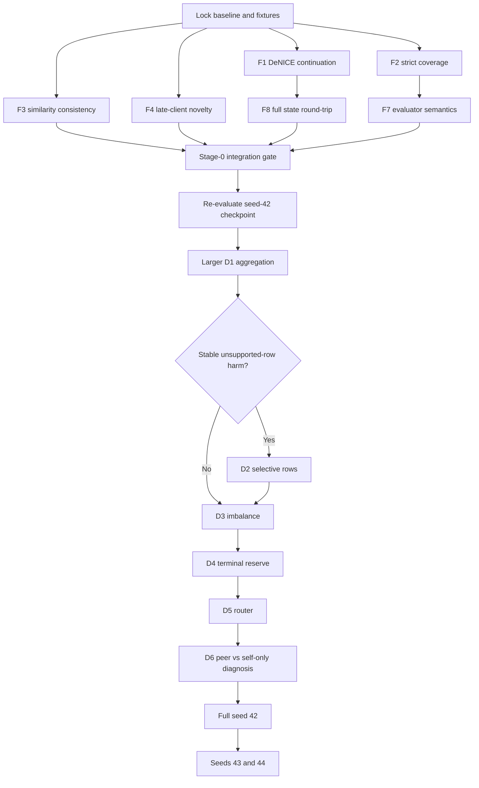

# DeNICE/CANDLE — Kế hoạch xử lý consolidated audit

**Ngày lập:** 2026-08-14  
**Nguồn review:** `C:\Users\khoak\Downloads\DeNICE_CANDLE_consolidated_audit_2026-08-14.md`  
**Đặc tả code hiện tại:** `denice_algorithm_current_2026-08-14.md`  
**Dataset mục tiêu:** `Dataset/2023/federated_splits/100-clients`  
**Baseline code:** commit `4966350` và ba commit DeNICE ngay trước đó (`663e7b4`, `ac32c75`, `fce3e3f`)

## Trạng thái thực thi (cập nhật 2026-08-14)

Đã hoàn thành Stage 0 và commit theo chuỗi `738a8ce`, `92d6748`,
`949da1b`, `a140945`, `9b8751e`:

- continuation DeNICE đầy đủ, strict coverage, adaptive-similarity provenance,
  late-client novelty, E3 semantic split và CANC diagnostics;
- continuous-vs-split CPU smoke pass; regression suite pass;
- D1 launcher mặc định đúng 20 clients × 5 rounds/task, strict evaluator và
  artifact validator;
- D1 ghi plastic-`fc2` row drift cùng peer support/unsupported alpha để quyết
  định D2 có bằng chứng.
- mỗi round ghi CANC action reachability/pressure terms và NICE full-output CE
  so với learner-only diagnostic; chưa thay objective từ các diagnostic này.
- launcher D1 tạo `d1_decision_report.json`; D2 chỉ mở khi strict protocol,
  chênh E3 macro-F1 >=1 pp, unsupported-row drift, và seed xác nhận cùng đạt.

Stage 1 đầy đủ vẫn cần checkpoint full seed-42 từ audit hoặc một full run mới.
Larger D1 cần GPU để chạy ở budget đã preregister; môi trường local hiện không
có CUDA. Artifact D1 smoke cũ là legacy protocol và validator cố ý từ chối nó
vì thiếu coverage provenance cùng E3 semantic mới.

Một strict re-evaluation đã chạy trên checkpoint D1 smoke peer-default cũ:
coverage 1,800/1,800 hợp lệ, nhưng adapter active 0/1,800 samples và
E3=E3b. Readout nằm trong artifact run; nó xác nhận checkpoint này không thể
là bằng chứng cho adapter/D2, nhưng không thay thế Stage 1 full seed-42.

Đã chuẩn bị D3-A/D3-B nhưng **chưa chạy**: `denice_batch_sampling=class_balanced`
là sampler cân bằng theo batch, có replacement nhưng giữ nguyên số lượt train
mỗi local epoch; `denice_class_weight_mode` nhận `inverse_frequency` hoặc
`effective_number`, smoothing và clip mặc định [0.25, 4.0]. Cả hai đều tắt mặc
định (`natural`/`none`), log histogram/unique-source samples và weight min/max
theo client/round. Validation chặn bật đồng thời A+B, trừ combined-confirmation
được opt-in rõ ràng. Continuation fixture đã chạy sampler A để kiểm tra RNG
round-trip; D3 vẫn chờ D1 full hợp lệ và fixed evaluation protocol.

Launcher `run_denice_d3_kaggle.py` hiện tạo baseline, D3-A và D3-B trên cùng
budget/support, chạy strict validator, và lưu prediction trace có source index
với client partition. `tools/analyze_denice_d3.py` fail-closed khi trace lệch,
tính paired-bootstrap E3 và gate old-class recall trước khi chỉ định candidate
cho seed xác nhận.

**D1 seed-42 đã hoàn tất hợp lệ (artifact `results_1408.zip`):** cả ba biến thể
có 15 round records (3 tasks × 5 rounds), strict coverage 1,800/1,800 và cùng
source-index hash `6ec098…65082`. E3 macro-F1: peer-default 0.14760,
self-only 0.20657, peer-self-floor-0.50 0.18929. Vì self-only hơn peer-default
5.90 pp và unsupported classifier rows có drift trung bình 0.04266 so với
0.04166 ở supported rows, hai điều kiện first-seed của D2 đạt. Decision report
giữ `KEEP_D2_CLOSED` đúng preregistration do chưa có seed-43/bootstrap
confirmation. Bước kế tiếp là D3 một-factor, không mở D2.

**D3 seed-42 đã hoàn tất hợp lệ (artifact `results_d3.zip`):** ba variants đều
pass validator (15 round records, strict fixed support). D3-A class-balanced
batches giảm E3 macro-F1 2.687 pp, bootstrap CI95% [-4.147, -1.357] pp, nên bị
loại. D3-B effective-number CE tăng E3 macro-F1 1.830 pp, CI95% [0.260, 3.396]
pp, E4 tăng 0.389 pp và old-class recall tăng 1.50 pp. Chỉ
`effective_number_ce` là `CANDIDATE_FOR_CONFIRMATION_SEED`; chạy lại D3 ở seed
43 trước khi chọn D3-B cho full run.

**D3 confirmation seed-43 đã hoàn tất hợp lệ (artifact `results_d3_43.zip`):**
mọi variant pass validator và trace alignment. Effective-number CE không tái
lập được lợi ích: E3 macro-F1 giảm 1.679 pp, bootstrap CI95% [-2.765, -0.563]
pp; dù old-class recall chỉ giảm 0.083 pp, CI E3 hoàn toàn âm nên bị loại.
Class-balanced sampler cũng không có lợi ích (CI chứa 0). Decision hợp lệ là
`KEEP_BASELINE`: D3 không thay objective/sampler của full run. Chuyển sang D4
baseline-reserve branch tại task 5 khi có full continuation task 4.

**D4 base seed-42 đã hoàn tất hợp lệ (artifact `results.zip`):** baseline đã
chạy tasks 0--4 với 25 round records và tạo
`continuation_state_task_4.pt`. Validator pass; warning không có P6 là expected
vì đây chỉ là shared checkpoint preparation, không phải endpoint đánh giá.
Hai nhánh D4 task-5 (`reserve_010`, `reserve_000`) hiện dùng đúng artifact này.

**D4 seed-42 đã hoàn tất hợp lệ (artifact `results (2).zip`):** cả hai branch
pass strict validator, cùng 30 round-history records và strict coverage. E3
macro-F1 đều 0.319316, E4 macro-F1 đều 0.245002 (route accuracy 0.51853), nên
reserve 0.10 không cải thiện plasticity/new-class metric. Nó chỉ giữ free
capacity khoảng 10% ở mọi layer (ví dụ client 0), trong khi reserve 0.00 dùng
hết capacity; adapter usage giống nhau. Theo gate D4, chọn `reserve_000` cho
bước sau vì reserve 0.10 không có lợi ích metric chứng minh được.

**D5 seed-42 đã hoàn tất hợp lệ (artifact `results (3).zip`, commit chạy
`8d285cc`):** ba router-reference budgets 20/50/100 được dựng lại post-hoc từ
local training split của đúng client, không có optimizer step. Cả ba checkpoint
có cùng `client_model_states` hash `9c2270…c2e40`, strict coverage 3,400/3,400,
cùng source-index hash `f0b269…4ca60`, cùng coverage-aware client partition.
E3 macro-F1 giữ nguyên 0.340049. E4 macro-F1 lần lượt là 0.267432, 0.267147,
0.268513; tương ứng E3−E4 gap 7.262, 7.290, 7.154 pp. Budget 100 giảm gap
0.108 pp so với 20, đồng thời E4 tăng 0.108 pp và route accuracy tăng 0.206 pp,
nhưng tốn 4.44 MiB input bank/58.84 MiB sketches và 100.44 s router refresh,
so với 0.94 MiB/13.25 MiB/22.39 s ở budget 20. Đây là tín hiệu một-seed rất
nhỏ; decision đúng là `FOLLOW_UP_FOR_ROUTER_MEMORY_GAIN`, **không** đổi cấu
hình full run cho tới khi calibration/reference-sampling follow-up xác nhận
hướng cải thiện.

## 1. Mục tiêu và nguyên tắc

Mục tiêu là biến các nhận xét trong audit thành một chuỗi thay đổi có thể kiểm chứng, trước khi tiếp tục tối ưu metrics. Kế hoạch ưu tiên theo thứ tự:

1. Khôi phục tính đúng đắn của protocol và trạng thái chạy.
2. Cố định evaluator và denominator để mọi số liệu có cùng ý nghĩa.
3. Chạy lại checkpoint hiện có, không train lại, nhằm tách lỗi đánh giá khỏi lỗi học.
4. Mở rộng D1 đủ mạnh để quyết định có cần D2 hay không.
5. Chỉ sau đó mới tối ưu mất cân bằng lớp, capacity reserve và router.
6. Chạy full seed 42 rồi mới xác nhận bằng seed 43/44.

Không thay đồng thời objective, aggregation và router trong một experiment. Mỗi commit phải có regression test và mỗi experiment phải lưu đủ artifact để truy ngược kết quả.

### Ngoài phạm vi ở giai đoạn correctness

- Không mặc định đổi NICE loss sang episode-only CE; đây là thay đổi phương pháp, không phải bug fix hiển nhiên.
- Không bật selective plastic-row aggregation D2 khi chưa có bằng chứng negative transfer ổn định.
- Không dùng kết quả smoke D1 hiện tại để kết luận peer aggregation tốt hoặc xấu.
- Không đưa `Dataset/`, `d1_local/` hoặc các checkpoint lớn vào Git.

## 2. Kết luận re-audit code hiện tại

| ID | Mức độ | Trạng thái | Bằng chứng trong code | Hướng xử lý |
|---|---:|---|---|---|
| F1 | P0 / critical | Xác nhận | `task_loop.py` dispatch DeNICE trước nhánh load resume; `run_decentralized_denice_il()` khởi tạo state mới | Xây continuation schema riêng cho DeNICE và restore ngay trong runner |
| F2 | P0 / high | Xác nhận | `eval_checkpoint.py` có đếm unsupported samples nhưng vẫn tiếp tục đánh giá | Strict coverage mặc định; partial coverage chỉ khi opt-in và phải báo denominator |
| F3 | P1 / high | Xác nhận | Clustering dùng adaptive effective weights, alpha lại gọi `context_similarity()` với base weights | Trả về và tái sử dụng cùng effective score matrix |
| F4 | P1 / high | Xác nhận | Late client clone model/router nhưng tạo `NoveltyEstimator` rỗng; `has_history=False` | Snapshot/clone novelty state và tách “global task 0” khỏi “first local appearance” |
| F5 | Conditional | Chưa đủ bằng chứng | Peer thiếu class vẫn có thể đổi plastic `fc2[c]` | Chỉ chạy D2 nếu larger D1 đạt gate negative transfer |
| F6 | Method issue | Xác nhận theo công thức | Logit nonlearner bằng 0 vẫn nằm trong CE denominator | Ghi rõ semantics, thêm diagnostic; đổi objective thành ablation riêng nếu cần |
| F7 | Eval semantics | Xác nhận | `oracle_hard` đồng thời oracle adapter và oracle class mask | Đổi nhãn thành routed-system ceiling, thêm oracle hard no-adapter |
| F8 | Resume/state | Một phần | Eval checkpoint đã lưu/restore ranks, masks, adapters, router; runner chưa continuation toàn hệ | Round-trip test toàn state và tích hợp vào F1 |
| F9 | Instrumentation | Xác nhận | `kappa_mid`, `kappa_high` chưa điều khiển quyết định hữu hiệu | Log components/branch; deprecate sau khi đo reachability |

## 3. Dependency graph



## 4. Stage 0 — Protocol correctness

### 4.1 Baseline lock và deterministic fixtures

**Mục đích:** mọi fix được so với cùng một input nhỏ, không phụ thuộc toàn bộ dataset hay GPU.

Thay đổi dự kiến:

- Tạo helper fixture DeNICE 2–3 clients, 2 tasks, 1–2 rounds/task trong `tests/`.
- Seed đồng thời Python, NumPy và PyTorch.
- Fixture phải có:
  - một client tham gia từ task 0;
  - một late client xuất hiện ở task 1;
  - ít nhất hai episode và router memory khác nhau;
  - adapters, ranks, freeze masks và novelty prototypes khác giá trị khởi tạo;
  - graph có ít nhất một peer edge.
- Thêm helper so sánh nested state với tensor/array tolerance rõ ràng.

Gate:

- Hai lần chạy fixture với cùng seed tạo cùng client schedule, cluster labels và model checksum.
- Fixture hoàn tất nhanh trên CPU và không ghi ra ngoài `tmp_path`.

### 4.2 F1 + F8 — Continuation đúng cho decentralized DeNICE

#### Thiết kế trạng thái

Tạo continuation payload có version riêng, ví dụ `denice_continuation_schema_version = 1`, gồm tối thiểu:

- Metadata: completed task, resume task, final round, seed, mode, algorithm, config fingerprint.
- `client_model_states` cho mọi client đã từng được materialize, không chỉ active client cuối task.
- `client_algorithm_states`:
  - neuron ages / `unit_ranks`;
  - `freeze_masks`;
  - adapter registry, adapter parameters nằm trong model state;
  - recycling registry;
  - toàn bộ `ContextDetector`: activation/reference memory, masks, thresholds, router models, episode classes, calibration/freshness metadata.
- Novelty state từng client: thresholds, prototypes và metadata cần thiết.
- Lifecycle state: materialized clients, last active task, previous ages, client references, rejoin history.
- Clustering state cần cho fallback: previous valid labels/groups/edges và các counters liên quan.
- Histories: round, cluster, adapter, debug và task metrics.
- RNG state của Python, NumPy, PyTorch CPU; CUDA state nếu có CUDA.

#### Luồng resume

`run_decentralized_denice_il()` phải là owner của việc restore vì đây là state đa model, không thể ép vào generic single-global-model resume path.

1. `task_loop.py` tiếp tục dispatch DeNICE, nhưng truyền nguyên `resume_state_path`.
2. DeNICE runner load và validate payload trước khi tạo vòng task.
3. Reconstruct kiến trúc adapter trước, sau đó load model weights.
4. Restore ranks/masks/recycling, detector, novelty và lifecycle state.
5. Set `start_task = resume_from_task`; không chạy lại task đã hoàn tất.
6. Restore RNG ngay trước phần stochastic tiếp theo.
7. Ghi log resume manifest: source file, schema, completed task, restored client count và checksum.
8. Nếu file là raw eval checkpoint chứ không phải continuation payload, fail với thông báo rõ; không auto-resume nửa state.

#### Files dự kiến

- `fed_learning/training/decentralized_denice_il.py`
- `fed_learning/training/resume_state.py` hoặc module mới `denice_resume_state.py`
- `fed_learning/training/checkpoint_state.py`
- `fed_learning/strategies/incremental/denice_novelty.py`
- `tests/test_resume_state.py`
- `tests/test_denice.py`

#### Regression tests

1. **State round-trip:** save → load → reconstruct bảo toàn model params, ranks, masks, adapters, recycling, detector và novelty.
2. **Split equivalence:** chạy task 0→1 liên tục và task 0 → save → process mới → task 1; so sánh:
   - client IDs và lifecycle;
   - cluster groups/edges;
   - CANC action;
   - model state với tolerance `atol <= 1e-6` trên CPU deterministic path;
   - metrics và history không bị lặp task 0.
3. **Late/rejoining client:** state không mất khi client vắng một task rồi quay lại.
4. **Compatibility:** schema thiếu trường bắt buộc fail-fast và nêu đúng field; version cũ chỉ được migrate nếu mapping đầy đủ.
5. **Mask behavior:** sau restore, một optimizer step không đổi mature/frozen rows.

Pass gate:

- Tất cả tests trên pass.
- Không còn đường chạy phase 1→2 nào silently fresh-start.
- Full `TRAIN_PHASE=5` và split phase tạo cùng kết quả trên fixture deterministic.

### 4.3 F2 — Coverage-aware evaluation không được đổi denominator im lặng

#### API/CLI

- Thêm lựa chọn explicit, tên đề xuất `--allow-partial-coverage`.
- Default là strict: nếu `unsupported_sample_count > 0`, raise `CoverageError`/`ValueError` trước inference.
- Partial mode vẫn chạy nhưng kết quả phải mang cờ `partial_coverage=true` và không được trình bày như full-test metric.

#### Artifact bắt buộc

Mỗi evaluation lưu:

- requested sample count;
- assigned/evaluated sample count;
- unsupported sample count tổng và theo episode/class;
- coverage rate = assigned / requested;
- source-index hash của requested và evaluated subset;
- eligible client count theo episode;
- policy strict/partial.

Invariant:

```text
strict mode:
unsupported_sample_count == 0
assigned_sample_count == requested_sample_count
sum(per_client_partition_sizes) == assigned_sample_count
```

Tests:

- Full coverage: strict mode pass và gán mỗi source index đúng một lần.
- Missing episode: strict mode fail trước model inference.
- Partial opt-in: chạy được, denominator và unsupported distribution đúng.
- Duplicate/omitted index: invariant phát hiện lỗi.

Files dự kiến: `eval_checkpoint.py`, `tests/test_denice.py`, script D1/evaluation wrappers nếu cần truyền flag.

### 4.4 F3 — Một định nghĩa similarity duy nhất cho clustering và alpha

#### Thiết kế

Thay kết quả clustering bằng cấu trúc chứa rõ:

- `effective_weights` sau adaptive suppression;
- `component_matrices` hoặc component values cần audit;
- `dense_effective_scores` cho mọi cặp hợp lệ;
- sparse AP matrix `S` và edge matrix `E`;
- threshold/top-k metadata.

`_aggregate_round()` không gọi lại `context_similarity(..., SimilarityWeights())`. Alpha của peer phải đọc đúng `dense_effective_scores[i, j]` đã sinh ra cluster của vòng đó.

Quy tắc fallback:

- Nếu AP result invalid nhưng dùng previous valid labels, peer alpha vẫn dùng effective scores của capsule hiện tại.
- Cặp không có score hợp lệ hoặc không finite nhận peer contribution 0.
- Self weight và peer floor/cap vẫn áp sau bước đọc score.
- Serialize effective weights, score summary và alpha source vào debug artifact.

Tests:

1. Component có variance thấp bị adaptive suppression và không quay lại trong alpha.
2. Hand-computed 3-client case: cluster score và alpha dùng cùng matrix cell.
3. Previous-label fallback không dùng stale score hay base weights.
4. Non-edge/invalid score không tạo peer contribution.
5. Tắt adaptive mode giữ behavior cũ trong tolerance.

Pass gate: với mỗi admitted peer trong fixture, logged `alpha_similarity` bằng đúng effective score được clustering trả về.

### 4.5 F4 — Late client không bị hiểu nhầm là global first task

#### Thiết kế

Tách hai khái niệm:

- `is_global_first_task = (task_id == 0)`;
- `has_novelty_baseline = novelty_estimator.has_history()`.

Khi bootstrap late client từ source:

- clone novelty thresholds/prototypes từ chính source cùng lúc clone model/router;
- deep-copy, không share mutable arrays;
- ghi provenance: source client, source task/round, model checksum;
- vì model là exact clone tại thời điểm bootstrap, prototype trong feature space tương thích;
- nếu model không exact clone hoặc checksum mismatch thì không dùng prototype cũ: phải rebuild từ retained references hoặc fail explicit.

Client rejoin có state riêng thì ưu tiên state của chính client; không overwrite bằng source bootstrap.

Tests:

- Late client tại task 1 với cloned history không bị ép `NICE_ONLY` chỉ vì mới xuất hiện.
- Client thật sự ở task 0 vẫn đi first-task branch.
- Clone novelty là độc lập bộ nhớ.
- Rejoin bảo toàn novelty history cũ.
- Model/prototype provenance mismatch được phát hiện.

Files dự kiến: `denice_novelty.py`, `decentralized_denice_il.py`, `tests/test_denice.py`.

### 4.6 F7 — Tách oracle adapter khỏi oracle mask

Chuẩn hóa tên báo cáo:

- E3 hiện tại (`oracle_hard`) đổi nhãn hiển thị thành **oracle routed-system ceiling**: oracle adapter + oracle episode class mask.
- Thêm `oracle_hard_no_adapter`: backbone/no adapter + oracle episode mask.
- Giữ `oracle_adapter_nomask` để đo adapter oracle nhưng không mask.
- E4 vẫn là deployed routed policy.

Decomposition cần báo cáo:

```text
adapter gain under oracle routing = E3 - oracle_hard_no_adapter
mask gain with oracle adapter     = E3 - oracle_adapter_nomask
deployment gap                    = E3 - E4
```

Không đổi key cũ ngay nếu làm hỏng scripts; có thể giữ alias một release nhưng metadata phải nêu semantics chính xác.

Tests: mask class đúng, adapter active đúng từng policy, và ba policy cho logits khác nhau trên fixture có adapter không-zero.

### 4.7 F6 + F9 — Instrument trước khi đổi method

NICE CE hiện tại phải được mô tả đúng là full-output CE với nonlearner logits bị zero, không gọi là episode-only CE.

Thêm diagnostic, chưa thay training objective:

- số learner/nonlearner output rows;
- tổng probability mass của nonlearner rows;
- full-output CE và episode-restricted CE đo song song trên eval batch;
- novelty components, capacity components, final novelty/capacity score;
- giá trị `kappa_low/mid/high` và action cuối;
- branch hit counters theo task/client.

Sau larger D1/D3:

- Nếu `kappa_mid/high` có zero branch hits trên toàn run, đánh dấu deprecated và bỏ khỏi search space.
- Chỉ mở ablation episode-only CE nếu nonlearner probability mass/material loss gap lớn và D3 không giải quyết được imbalance.

### 4.8 Stage-0 integration gate

Không chạy experiment tuning trước khi:

- toàn bộ unit/regression tests mới pass;
- `pytest tests/test_denice.py tests/test_resume_state.py -q` pass;
- coverage strict invariant pass;
- split-run equivalence pass;
- similarity audit invariant pass;
- late-client test pass;
- một CPU smoke run 2 tasks không có NaN/Inf và lưu đủ manifest.

## 5. Stage 1 — Re-audit checkpoint seed 42, không retrain

Mục tiêu là xác định metrics tệ đến từ evaluator, router, adapter hay backbone bằng chính checkpoint đã có.

Chạy cùng một balanced test support và cùng source-index hash cho:

1. backbone no mask;
2. predicted adapter no mask;
3. oracle adapter no mask;
4. oracle hard no adapter;
5. oracle routed-system ceiling (E3);
6. deployed routed policy (E4);
7. representative/ensemble chỉ khi coverage strict pass.

Báo cáo:

- accuracy, macro-F1, weighted-F1;
- recall theo class và theo old/new classes;
- confusion matrix;
- router accuracy, coverage, confidence, entropy;
- per-client support và per-episode coverage;
- adapter gain, mask gain, deployment gap;
- checkpoint/config/source-index hashes.

Kết quả stage này là một report mới; không ghi đè artifact cũ.

## 6. Stage 2 — Larger D1: peer aggregation

### 6.1 Cấu hình cố định

- Dataset: 100-client split đã thêm.
- Subset: 20 clients, danh sách client ID cố định và lưu vào manifest.
- Tasks: 0–2.
- Rounds: chọn 5 rounds/task cho screening; tăng 10 chỉ để xác nhận nếu kết quả sát gate.
- Eval: class-balanced fixed support; cùng source indices giữa variants.
- Seed screening: 42; nếu có chênh lệch material thì xác nhận seed 43 trước khi quyết định D2.
- Mọi config ngoài aggregation phải giống hệt nhau.

### 6.2 Ba variants

| Variant | Peer behavior | Mục đích |
|---|---|---|
| D1-A | peer floor 0.25 / corrected default | mức peer vừa phải |
| D1-B | self-only | control không peer |
| D1-C | peer floor 0.50 | stress test peer mạnh |

### 6.3 Metrics bắt buộc

- E3 và E4 accuracy/macro-F1;
- old-class/new-class recall;
- per-class recall/F1;
- peer alpha mean/median/p10/p90;
- group size, edge density, fallback rate;
- support mismatch theo peer/class;
- plastic `fc2` row drift theo class;
- negative transfer delta so với self-only;
- wall time và state/artifact hashes.

### 6.4 Gate quyết định D2

D2 chỉ được mở nếu cả ba điều kiện cùng đúng:

1. Peer variant kém self-only ít nhất **1.0 điểm phần trăm E3 macro-F1** trên fixed support.
2. Bootstrap 95% CI của paired per-sample/per-class delta không chứa 0, hoặc dấu chênh lệch lặp lại ở seed 43.
3. Suy giảm tập trung ở class rows mà peer không có support, kèm row-drift lớn hơn supported rows.

Nếu không đạt đủ ba điều kiện: đóng D2, giữ aggregation đơn giản và chuyển sang D3.

## 7. Stage 3 — D3: xử lý class imbalance

Chạy tuần tự, mỗi bước kế thừa Stage-0 fixes và aggregation thắng D1.

| Variant | Thay đổi duy nhất |
|---|---|
| D3-A | class-balanced local batches/sampler |
| D3-B | clipped/smoothed inverse-frequency hoặc effective-number CE |
| D3-C | bounded classifier-only calibration sau train, chỉ nếu A/B chưa đủ |

Quy tắc:

- A và B không bật đồng thời ở vòng đầu để biết hiệu ứng riêng.
- Weight loss phải clip và log min/max; không dùng raw inverse frequency không giới hạn.
- Calibration không cập nhật backbone/adapters và dùng split riêng, không dùng test labels để fit.
- Primary metric: E3 macro-F1; secondary: E4 macro-F1 và minimum per-class recall.
- Không chấp nhận variant nếu cải thiện macro-F1 nhưng làm old-class recall giảm material; ngưỡng preregister là 1.0 điểm phần trăm.

Chọn variant bằng paired bootstrap trên fixed evaluation support, sau đó xác nhận một seed bổ sung trước full run.

## 8. Stage 4 — D4: terminal capacity reserve

So sánh chỉ ở task 5:

- reserve 0.10;
- reserve 0.00.

Giữ checkpoint đầu task 5 giống nhau để tránh train lại task 0–4 và giảm nhiễu. Báo cáo:

- E3/E4 macro-F1;
- task-5/new-class recall;
- old-class recall;
- fraction young/learner/mature theo layer;
- released unit count và adapter usage.

Chỉ giữ reserve 0.10 nếu nó cải thiện plasticity/new-class metrics mà không làm old-class recall giảm quá 1.0 điểm phần trăm.

## 9. Stage 5 — D5: router generalization

### 9.1 Matrix

- `router_reference_per_class`: 20, 50, 100.
- Fit/calibration/reference sets tách biệt.
- D5 dựng lại reference bank từ local **training** split của từng client bằng
  seed cố định và refit router sau khi checkpoint D4 đã hoàn tất. Không chạy
  optimizer, không đổi tensor model/adapter/capacity; manifest bắt buộc hash
  toàn bộ `client_model_states` trước/sau để chứng minh invariant này.
- Sampling không chứa budget trong seed để bank 20 là tập con của 50, và 50 là
  tập con của 100 (khi local class đủ mẫu). Không được cố "nới" checkpoint
  router cũ: nó chỉ lưu số raw references đã dùng khi train.
- Cùng trained model và cùng evaluation support giữa ba mức memory.
- Báo cáo storage/latency cùng accuracy để tránh chọn 100 chỉ vì dùng nhiều memory hơn.

### 9.2 Metrics và gate

- route accuracy/balanced accuracy;
- per-episode recall;
- confidence, entropy, calibration error;
- route coverage;
- E3, E4 và deployment gap E3−E4;
- feature drift giữa stored/current representation.

Chọn cấu hình làm giảm E3−E4 rõ ràng mà không giảm E3 quá 0.5 điểm phần trăm và không vi phạm strict coverage.

Nếu tăng refs không cải thiện, điều tra representation drift/calibration thay vì tiếp tục tăng memory.

## 10. Stage 6 — D2 selective plastic-row aggregation, chỉ khi được kích hoạt

Nếu larger D1 đạt gate, so sánh:

- D2-control: aggregation hiện tại đã sửa F3;
- D2-mask: peer chỉ đóng góp plastic `fc2[c]` khi peer có support class `c`;
- hidden/shared layers giữ nguyên để cô lập hiệu ứng classifier row.

Yêu cầu implementation:

- support mask có provenance từ local training support, không suy từ test data;
- denominator renormalize theo từng row;
- row không có peer hợp lệ giữ self update;
- log number/ratio rows blocked và peer weight trước/sau mask.

Gate giữ D2: cải thiện E3 macro-F1 và unsupported-class recall, không làm supported-class/old-class recall giảm quá 1.0 điểm phần trăm, lặp lại ở ít nhất hai seeds.

## 11. Stage 7 — Full experiment và xác nhận nhiều seed

1. Freeze config sau D1–D5/D2.
2. Full seed 42, toàn bộ task/client budget mục tiêu.
3. Chỉ khi run hợp lệ theo artifact validator mới chạy seeds 43 và 44.
4. Báo cáo mean ± std và paired deltas so baseline corrected.
5. Mọi bảng phải phân biệt:
   - legacy result trước correctness fixes;
   - corrected-protocol result;
   - tuned-method result.

Không so trực tiếp legacy metric với corrected metric như cùng protocol.

### 11.1 Run budget và stop rules

| Stage | Run/evaluation tối thiểu | Run có điều kiện | Stop rule |
|---|---:|---:|---|
| Stage 0 | unit tests + 1 CPU smoke | 1 split-equivalence integration run | Dừng ngay nếu bất kỳ correctness gate nào fail |
| Stage 1 | 1 checkpoint × 7 policies | 0 | Không retrain; dừng nếu coverage/checkpoint invalid |
| D1 | 3 variants × seed 42 | lặp seed 43 và/hoặc 10 rounds cho chênh lệch sát gate | Không mở D2 nếu thiếu bằng chứng unsupported-row harm |
| D3 | 3 single-factor variants | 1 combined confirmation nếu A và B đều thắng | Dừng variant gây old-class regression vượt gate |
| D4 | 2 variants từ cùng task-5 start checkpoint | 0–1 seed xác nhận | Không train lại task 0–4 cho mỗi variant |
| D5 | 3 reference budgets trên cùng trained model | 1 calibration/drift follow-up | Dừng tăng memory nếu E3−E4 không giảm |
| D2 | 0 mặc định | 2 variants × ít nhất 2 seeds | Bỏ hoàn toàn nếu D1 gate không kích hoạt |
| Full | seed 42 | seeds 43, 44 | Không chạy seed tiếp theo nếu validator seed 42 fail |

Ưu tiên dùng checkpoint branching ở D4/D5 và fixed evaluator supports để giảm compute. Không đặt thời gian chạy tuyệt đối trước khi đo wall time của larger D1 seed 42; sau run đầu, ghi throughput thực tế và ước lượng phần còn lại vào experiment manifest.

### 11.2 Failure handling và rollback

- Correctness fix nào làm legacy checkpoint không đọc được phải có migration test hoặc thông báo incompatibility rõ; không silently default missing state.
- Nếu split equivalence lệch, so state theo thứ tự: RNG → client schedule → lifecycle → cluster → optimizer/model; chưa chạy experiment cho tới khi tìm ra điểm lệch đầu tiên.
- Nếu một experiment crash, resume chỉ từ continuation artifact đã qua checksum/validator; không ghép history thủ công.
- Nếu metric tăng nhưng protocol hash/coverage khác control, xem run là invalid thay vì improvement.
- Giữ artifact legacy read-only; mọi corrected evaluation ghi sang directory mới.

## 12. Artifact contract và validator

Mỗi run directory cần có:

- resolved config và Git commit;
- dataset root tương đối, split fingerprint và client list;
- seed/RNG metadata;
- checkpoint/continuation schema versions;
- task/round histories;
- coverage manifest và source-index hashes;
- cluster effective weights/scores/edges;
- peer alpha statistics;
- CANC branch counters;
- neuron/capacity and adapter usage;
- E3/E4 decomposition;
- completion marker chỉ ghi sau khi mọi file flush thành công.

Validator phải fail run khi:

- thiếu task/round dự kiến;
- unsupported samples trong strict mode;
- NaN/Inf metrics;
- source-index hash khác giữa variants của cùng experiment;
- resume manifest không khớp config/split;
- history lặp task hoặc checkpoint chain đứt;
- claimed E3/E4 không có policy metadata.

## 13. Thứ tự commit đề xuất

Mỗi commit dưới đây phải green; không commit dataset/artifacts.

1. `docs(denice): add consolidated audit action plan`
2. `test(denice): add deterministic continuation fixtures`
3. `fix(denice): implement full decentralized continuation state`
4. `test(denice): enforce continuation and mask round-trip equivalence`
5. `fix(eval): fail closed on incomplete coverage-aware partitions`
6. `fix(denice): reuse adaptive similarity scores for aggregation`
7. `fix(denice): inherit novelty state for late clients`
8. `feat(eval): separate oracle adapter and oracle mask ceilings`
9. `feat(denice): instrument CANC branches and NICE loss semantics`
10. `feat(experiments): add validated larger D1 matrix`
11. Các commit D3/D4/D5 riêng, chỉ sau khi decision report của stage trước tồn tại.
12. D2 chỉ có commit nếu D1 gate kích hoạt.

Nếu implementation và test không thể tách mà vẫn giữ branch green, gộp test vào cùng commit fix; không để commit trung gian làm suite fail.

## 14. Checklist triển khai

### Trước khi sửa code

- [ ] Ghi `git rev-parse HEAD` và `git status --short`.
- [ ] Bảo vệ các thư mục untracked: `Dataset/`, `d1_local/`, root context file.
- [ ] Chạy test baseline và lưu log.
- [ ] Chốt fixture seed và client schedule.

### Trước mỗi experiment

- [ ] Stage-0 suite pass.
- [ ] Config diff chỉ chứa factor đang test.
- [ ] Fixed evaluation indices/hash giống nhau.
- [ ] Coverage strict pass.
- [ ] Output directory mới, không overwrite.
- [ ] Manifest chứa commit/config/dataset fingerprint.

### Sau mỗi experiment

- [ ] Validator pass trước khi đọc metrics.
- [ ] Kiểm tra task/round count và completion marker.
- [ ] Xuất per-class, old/new và routing diagnostics.
- [ ] Ghi decision theo preregistered gate, kể cả kết quả âm.
- [ ] Không chạy stage sau nếu gate stage hiện tại chưa kết luận.

## 15. Definition of Done

Audit được xem là xử lý xong khi:

1. Split-run DeNICE tương đương continuous run trên deterministic fixture.
2. Coverage-aware evaluator không còn silently bỏ mẫu.
3. Clustering và aggregation alpha dùng cùng effective similarity.
4. Late client có novelty history hợp lệ và không bị first-task fallback sai.
5. Full client state round-trip bảo toàn behavior, không chỉ tensor weights.
6. E3 semantics rõ và oracle adapter/mask đã được tách.
7. Larger D1 đưa ra quyết định định lượng về D2.
8. D3, D4, D5 được chạy tuần tự với fixed protocol và artifact validator.
9. Full seed 42 hợp lệ, sau đó seeds 43/44 tái xác nhận kết luận.
10. Báo cáo cuối truy được mỗi con số về đúng checkpoint, config, dataset split và evaluation indices.
