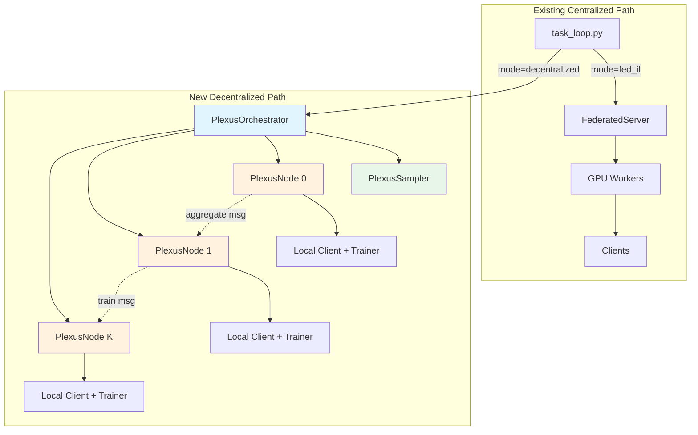
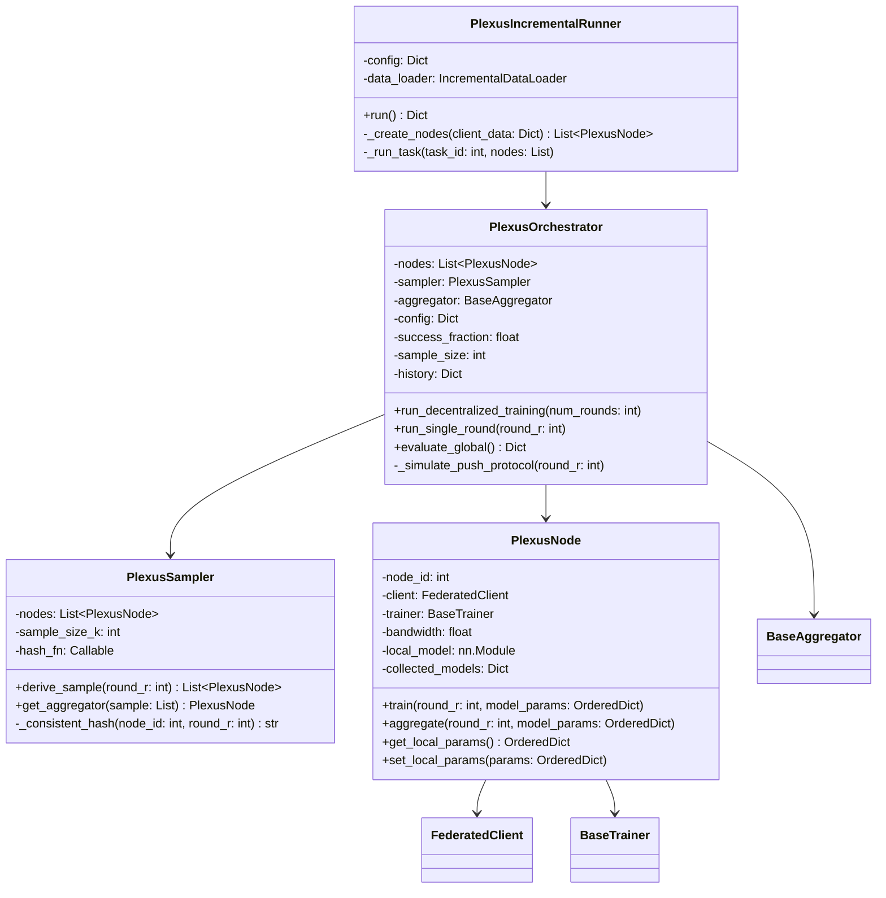
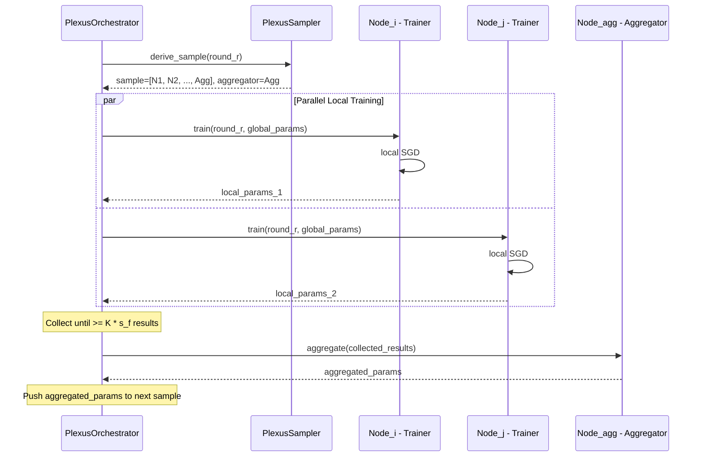

# Plexus Decentralized Module — Implementation Plan

## 1. Executive Summary

This plan describes how to add a **Plexus-based decentralized federated learning module** to the existing AI4FIDS codebase. Plexus (Dhasade et al., EuroMLSys 2025) eliminates the central server by using:

1. **Consistent-hashing peer sampling** — deterministic, coordination-free sample selection
2. **Rotating aggregator** — bandwidth-based aggregator election within each sample
3. **Push-based train/aggregate protocol** — sample _k_'s aggregator triggers sample _k+1_

The design preserves **full backward compatibility** with the existing centralized FL pipeline while introducing a new `mode = "decentralized"` execution path.

---

## 2. Plexus Paper — Key Algorithms

### Algorithm 1: Peer Sampling (Consistent Hashing)

```
function DERIVE_SAMPLE(Nodes, round_r, K):
    scored = [(hash(node_id || round_r), node_id) for node in Nodes]
    scored.sort()            # lexicographic sort on hash
    sample = scored[:K]      # take first K nodes
    aggregator = argmax(sample, key=bandwidth)
    return sample, aggregator
```

- Every node can independently compute the same sample for round `r`
- `K` ≈ 10–13 recommended for 1000 nodes
- Aggregator = node with highest bandwidth in the sample

### Algorithm 2: Push-Based Training

```
upon receive TRAIN(round_r, model_M):
    M_local = local_train(M, local_data)
    sample, aggregator = DERIVE_SAMPLE(Nodes, round_r, K)
    send(aggregator, AGGREGATE(round_r, M_local))

upon receive AGGREGATE(round_r, M_i):
    collected[round_r].add(M_i)
    if len(collected[round_r]) >= K * success_fraction:
        M_agg = weighted_average(collected[round_r])
        sample_next, _ = DERIVE_SAMPLE(Nodes, round_r + 1, K)
        for node in sample_next:
            send(node, TRAIN(round_r + 1, M_agg))
```

- `success_fraction` (s_f) = 0.8 — proceed when 80% of sample has reported
- Push-based: completion of round _r_ triggers round _r+1_

---

## 3. Current Architecture Analysis

### Centralized Pattern (existing)

```
FederatedServer.train_round()
  ├── get_global_params()           # snapshot global model
  ├── distribute clients to GPUs    # round-robin
  ├── Thread(train_clients_on_gpu)  # parallel training
  ├── join threads, collect results
  ├── aggregator.aggregate()        # strategy-based aggregation
  └── set_global_params()           # update global model
```

### Key Integration Points

| Component | File | Role |
|---|---|---|
| Base server | [`server.py`](fed_learning/servers/server.py) | Central coordinator with `train_round()` |
| Runner | [`runner.py`](fed_learning/training/runner.py) | Round loop calling `server.train_round()` |
| Task loop | [`task_loop.py`](fed_learning/training/task_loop.py:366) | Entry point `run_incremental_training()` |
| Server factory | [`server_factory.py`](fed_learning/factories/server_factory.py) | Registry `_SERVER_REGISTRY` |
| Client factory | [`client_factory.py`](fed_learning/factories/client_factory.py) | Registry `_CLIENT_REGISTRY` |
| Strategy registry | [`__init__.py`](fed_learning/strategies/__init__.py:57) | `STRATEGIES` dict |
| Base worker | [`base_worker.py`](fed_learning/training/base_worker.py) | GPU worker template |
| Base trainer | [`trainer.py`](fed_learning/core/trainer.py) | Training strategy ABC |
| Base aggregator | [`aggregator.py`](fed_learning/core/aggregator.py) | Aggregation strategy ABC |

---

## 4. Architecture Design

### 4.1 Design Principles

1. **Simulation-first**: Since we run on a single machine (multi-GPU), we simulate the decentralized protocol by having each `PlexusNode` object act as an independent peer
2. **Reuse existing strategies**: Plexus is topology-agnostic — any existing trainer/aggregator pair (FedAvg, EWC, DER, etc.) can be used inside Plexus nodes
3. **New mode, not new algorithm**: Add `mode = "decentralized"` alongside existing `"fed_il"` and `"il"` modes
4. **Minimal core changes**: Only touch factories and task_loop entry point; all Plexus logic lives in new files

### 4.2 High-Level Architecture



### 4.3 Class Diagram



### 4.4 Sequence Diagram — One Decentralized Round



---

## 5. New Files to Create

| # | File Path | Description |
|---|---|---|
| 1 | `fed_learning/decentralized/__init__.py` | Package init, exports |
| 2 | `fed_learning/decentralized/sampler.py` | `PlexusSampler` — consistent hashing peer sampling |
| 3 | `fed_learning/decentralized/node.py` | `PlexusNode` — autonomous peer with local train/aggregate |
| 4 | `fed_learning/decentralized/orchestrator.py` | `PlexusOrchestrator` — simulation coordinator |
| 5 | `fed_learning/decentralized/runner.py` | `PlexusIncrementalRunner` — incremental task loop for decentralized mode |
| 6 | `fed_learning/decentralized/metrics.py` | Decentralized-specific metrics (communication cost, aggregation count, convergence tracking) |
| 7 | `tests/test_plexus.py` | Unit tests for sampler, node, orchestrator |

---

## 6. Existing Files to Modify

| # | File | Change |
|---|---|---|
| 1 | [`task_loop.py`](fed_learning/training/task_loop.py:382) | Add `mode = "decentralized"` branch in `run_incremental_training()` |
| 2 | [`strategies/__init__.py`](fed_learning/strategies/__init__.py:57) | No change needed — Plexus reuses existing strategies |
| 3 | [`__init__.py`](fed_learning/__init__.py) | Add `decentralized` subpackage import |

> **Note**: Factories (`server_factory.py`, `client_factory.py`) are NOT modified because Plexus does not use a centralized server. Nodes create their own clients directly.

---

## 7. Detailed Implementation Spec

### 7.1 `PlexusSampler` — [`sampler.py`](fed_learning/decentralized/sampler.py)

**Purpose**: Implements Algorithm 1 from the paper — deterministic, coordination-free peer sampling.

```python
class PlexusSampler:
    def __init__(self, node_ids: List[int], sample_size: int = 10,
                 hash_algorithm: str = "sha256"):
        self.node_ids = sorted(node_ids)
        self.sample_size = min(sample_size, len(node_ids))
        self.hash_algorithm = hash_algorithm

    def derive_sample(self, round_r: int) -> Tuple[List[int], int]:
        """Paper Algorithm 1: Consistent hashing sample derivation.
        
        Returns:
            (sample_node_ids, aggregator_node_id)
        """
        scored = []
        for nid in self.node_ids:
            h = hashlib.new(self.hash_algorithm,
                           f"{nid}:{round_r}".encode()).hexdigest()
            scored.append((h, nid))
        scored.sort(key=lambda x: x[0])
        sample_ids = [nid for _, nid in scored[:self.sample_size]]
        return sample_ids, sample_ids[0]  # default aggregator = first in sorted hash

    def get_aggregator(self, sample_ids: List[int],
                       bandwidths: Dict[int, float]) -> int:
        """Select aggregator as node with highest bandwidth in sample."""
        return max(sample_ids, key=lambda nid: bandwidths.get(nid, 0.0))
```

**Key properties**:
- Deterministic: same `(node_ids, round_r)` always produces same sample
- O(N log N) per round (sort all nodes) — acceptable for simulation
- Hash concatenation format: `"{node_id}:{round}"` as in paper

### 7.2 `PlexusNode` — [`node.py`](fed_learning/decentralized/node.py)

**Purpose**: Represents an autonomous peer node that can both train and aggregate.

```python
class PlexusNode:
    def __init__(self, node_id: int, client: FederatedClient,
                 config: Dict, bandwidth: float = 1.0):
        self.node_id = node_id
        self.client = client
        self.config = config
        self.bandwidth = bandwidth
        self.local_model = None       # nn.Module
        self.collected_models = {}    # round -> List[Dict]
        self.device = "cpu"

    def setup_model(self, model: nn.Module, device: str):
        """Initialize local model copy."""
        self.local_model = copy.deepcopy(model).to(device)
        self.device = device

    def train_local(self, round_r: int, global_params: OrderedDict,
                    trainer: BaseTrainer) -> Dict:
        """Execute local training using existing trainer strategy.
        
        Paper Algorithm 2: upon receive TRAIN(r, M)
        """
        # Load global params
        self.local_model.load_state_dict(
            {k: v.to(self.device) for k, v in global_params.items()})

        # Setup client for GPU
        self.client.setup_for_gpu(self.local_model, self.device)

        # Train using existing strategy hooks
        result = self.client.train(
            model=self.local_model,
            device=self.device,
            trainer=trainer,
            **self._get_train_kwargs()
        )
        return {
            "client_id": self.node_id,
            "params": OrderedDict(
                (k, v.cpu().clone())
                for k, v in self.local_model.state_dict().items()
            ),
            "num_samples": self.client.num_samples,
            "loss": result.get("loss", 0.0),
        }

    def receive_for_aggregation(self, round_r: int, result: Dict):
        """Paper Algorithm 2: upon receive AGGREGATE(r, M_i)"""
        if round_r not in self.collected_models:
            self.collected_models[round_r] = []
        self.collected_models[round_r].append(result)

    def can_aggregate(self, round_r: int, threshold: int) -> bool:
        """Check if enough models collected (K * s_f)."""
        return len(self.collected_models.get(round_r, [])) >= threshold

    def aggregate(self, round_r: int,
                  aggregator: BaseAggregator,
                  global_params: OrderedDict) -> OrderedDict:
        """Perform aggregation on collected models."""
        results = self.collected_models.pop(round_r, [])
        return aggregator.aggregate(results, global_params)
```

**Design decisions**:
- Each node wraps an existing `FederatedClient` — zero duplication of training logic
- Accepts any `BaseTrainer` — works with all 12+ algorithms in the codebase
- `collected_models` dict handles asynchronous/partial collection semantics
- `bandwidth` attribute used for aggregator selection

### 7.3 `PlexusOrchestrator` — [`orchestrator.py`](fed_learning/decentralized/orchestrator.py)

**Purpose**: Simulates the decentralized protocol on a single machine. Replaces `FederatedServer` + `runner.py` for decentralized mode.

```python
class PlexusOrchestrator:
    def __init__(self, nodes: List[PlexusNode], config: Dict,
                 trainer: BaseTrainer, aggregator: BaseAggregator):
        self.nodes = nodes
        self.node_map = {n.node_id: n for n in nodes}
        self.config = config
        self.trainer = trainer
        self.aggregator = aggregator

        # Plexus params
        self.sample_size = config.get("plexus_sample_size", 10)
        self.success_fraction = config.get("plexus_success_fraction", 0.8)

        # Create sampler
        node_ids = [n.node_id for n in nodes]
        self.sampler = PlexusSampler(node_ids, self.sample_size)

        # Bandwidths (simulated)
        self.bandwidths = {n.node_id: n.bandwidth for n in nodes}

        # Tracking
        self.history = {"train_loss": [], "rounds_info": []}
        self.global_params = None  # current best params

    def run_decentralized_round(self, round_r: int,
                                 verbose: bool = True) -> Dict:
        """Simulate one Plexus round.
        
        Steps:
        1. Derive sample for this round
        2. Select aggregator
        3. Train all nodes in sample (parallel on GPUs)
        4. Apply success fraction threshold
        5. Aggregate at selected aggregator node
        6. Return aggregated params
        """
        # Step 1-2: Sample derivation
        sample_ids, _ = self.sampler.derive_sample(round_r)
        agg_id = self.sampler.get_aggregator(sample_ids, self.bandwidths)
        agg_node = self.node_map[agg_id]
        sample_nodes = [self.node_map[sid] for sid in sample_ids]

        if verbose:
            print(f"  Round {round_r}: sample={sample_ids}, "
                  f"aggregator={agg_id}")

        # Step 3: Parallel local training (GPU-distributed)
        results = self._parallel_train(sample_nodes, round_r)

        # Step 4: Success fraction filter
        threshold = int(self.sample_size * self.success_fraction)
        accepted = results[:max(threshold, len(results))]

        # Step 5: Aggregate
        for r in accepted:
            agg_node.receive_for_aggregation(round_r, r)

        new_params = agg_node.aggregate(
            round_r, self.aggregator, self.global_params)
        self.global_params = new_params

        # Metrics
        avg_loss = np.mean([r["loss"] for r in accepted])
        return {
            "train_loss": avg_loss,
            "sample_size": len(sample_ids),
            "accepted": len(accepted),
            "aggregator": agg_id,
        }

    def _parallel_train(self, nodes: List[PlexusNode],
                         round_r: int) -> List[Dict]:
        """Train nodes in parallel across GPUs (reuse threading pattern)."""
        # Distribute nodes across GPUs, similar to existing server.train_round()
        num_gpus = self.config.get("num_gpus", 1)
        results_dict = {}
        threads = []

        nodes_per_gpu = [[] for _ in range(num_gpus)]
        for i, node in enumerate(nodes):
            nodes_per_gpu[i % num_gpus].append(node)

        for gpu_id in range(num_gpus):
            if nodes_per_gpu[gpu_id]:
                t = Thread(
                    target=self._train_nodes_on_gpu,
                    args=(gpu_id, nodes_per_gpu[gpu_id],
                          round_r, results_dict))
                threads.append(t)
                t.start()

        for t in threads:
            t.join()

        return list(results_dict.values())

    def _train_nodes_on_gpu(self, gpu_id, nodes, round_r, results_dict):
        """Train a batch of nodes on a single GPU."""
        device = f"cuda:{gpu_id}" if torch.cuda.is_available() else "cpu"
        for node in nodes:
            node.device = device
            result = node.train_local(round_r, self.global_params, self.trainer)
            results_dict[node.node_id] = result
```

**Key design choices**:
- Reuses the same threading pattern as [`FederatedServer.train_round()`](fed_learning/servers/server.py:105) for GPU parallelism
- `global_params` tracks the latest aggregated model (equivalent to server's global model)
- Plugs in any `BaseTrainer` + `BaseAggregator` from the strategy registry

### 7.4 `PlexusIncrementalRunner` — [`runner.py`](fed_learning/decentralized/runner.py)

**Purpose**: Replaces [`run_incremental_training()`](fed_learning/training/task_loop.py:366) for decentralized mode. Manages the task loop with Plexus orchestration.

```python
class PlexusIncrementalRunner:
    def __init__(self, config: Dict):
        self.config = config
        self.data_loader = IncrementalDataLoader(config["data_dir"])

    def run(self) -> Dict:
        """Main entry point for decentralized incremental training."""
        # 1. Setup
        trainer, aggregator = get_strategy(**self.config)
        all_history = {"task_accuracies": [], "task_forgetting": []}
        persistent_nodes = {}

        # 2. Task Loop
        for task_id in range(self.data_loader.get_num_tasks()):
            # 2a. Prepare client data
            client_data_map = self._load_task_data(task_id)

            # 2b. Create/update PlexusNodes
            nodes = self._prepare_nodes(
                client_data_map, task_id, persistent_nodes)

            # 2c. Create orchestrator for this task
            orchestrator = PlexusOrchestrator(
                nodes, self.config, trainer, aggregator)

            # Initialize with previous global params
            if task_id > 0:
                orchestrator.global_params = self.global_params

            # 2d. Initialize global model
            if orchestrator.global_params is None:
                model = CNN_GRU_Model(
                    self.config["input_shape"],
                    self.config["total_classes"]
                )
                orchestrator.global_params = OrderedDict(
                    (k, v.cpu()) for k, v in model.state_dict().items()
                )

            # 2e. Train rounds
            for r in range(self.config["rounds_per_task"]):
                round_info = orchestrator.run_decentralized_round(r)
                # ... logging ...

            # 2f. Save global params for next task
            self.global_params = orchestrator.global_params

            # 2g. Evaluate
            metrics = self._evaluate(orchestrator, task_id)
            all_history["task_accuracies"].append(metrics)

        return all_history
```

### 7.5 `PlexusMetrics` — [`metrics.py`](fed_learning/decentralized/metrics.py)

**Purpose**: Track decentralized-specific metrics.

| Metric | Formula | Description |
|---|---|---|
| Communication rounds | Count of aggregate messages | How many aggregation events occurred |
| Participation rate | `accepted / sample_size` per round | Fraction of sample that contributed |
| Sample diversity | Unique nodes across all rounds / total nodes | How well hashing distributes participation |
| Aggregator distribution | Histogram of which nodes served as aggregator | Fairness of aggregator rotation |
| Convergence rate | Accuracy vs. round, compared to centralized baseline | Speed comparison |

---

## 8. Configuration Schema

New config keys for Plexus mode (added to existing CONFIG dict):

```python
# In train_incremental_kaggle.py CONFIG
{
    "mode": "decentralized",         # NEW: triggers Plexus path
    "algorithm": "fedavg",           # EXISTING: any algorithm works inside Plexus

    # Plexus-specific params
    "plexus_sample_size": 10,        # K — number of nodes per sample
    "plexus_success_fraction": 0.8,  # s_f — threshold for aggregation
    "plexus_hash_algorithm": "sha256",  # Hash function for sampling
    "plexus_bandwidth_mode": "uniform", # "uniform" | "heterogeneous" | "custom"
    "plexus_bandwidth_range": [0.5, 1.5],  # Range for heterogeneous bandwidth
}
```

---

## 9. Integration with Existing Task Loop

The only change to [`run_incremental_training()`](fed_learning/training/task_loop.py:366):

```python
def run_incremental_training(config: Dict[str, Any]):
    mode = config.get("mode", "fed_il").lower()
    if mode == "il":
        from fed_learning.training.local_task_loop import run_local_incremental_training
        return run_local_incremental_training(config)
    elif mode == "decentralized":                          # NEW
        from fed_learning.decentralized.runner import PlexusIncrementalRunner
        runner = PlexusIncrementalRunner(config)
        return runner.run()
    elif mode != "fed_il":
        raise ValueError("Unsupported mode. Use 'fed_il', 'il', or 'decentralized'.")
    # ... existing fed_il code ...
```

---

## 10. Data Flow Comparison

### Centralized (existing)

```
Server holds global_model
  → broadcast params to ALL clients
  → ALL clients train in parallel
  → Server aggregates ALL results
  → Server updates global_model
```

### Decentralized (Plexus)

```
Orchestrator holds global_params (latest aggregated)
  → Sampler selects K nodes for this round
  → ONLY K nodes train in parallel
  → Results sent to elected aggregator node
  → Aggregator node aggregates when >= K * s_f results arrive
  → Aggregated params become new global_params
  → Next round: different K nodes selected by hash
```

**Key difference**: Not all clients participate every round — only a deterministic subset of size K.

---

## 11. Test Plan

### Unit Tests (`tests/test_plexus.py`)

| Test | Description |
|---|---|
| `test_sampler_deterministic` | Same inputs always produce same sample |
| `test_sampler_uniform_distribution` | Over many rounds, all nodes participate roughly equally |
| `test_sampler_correct_size` | Sample size = min(K, total_nodes) |
| `test_aggregator_selection` | Node with highest bandwidth in sample is selected |
| `test_node_train_local` | Node can train using FedAvgTrainer and return params |
| `test_node_collect_and_aggregate` | Node can collect models and aggregate when threshold met |
| `test_orchestrator_single_round` | One round completes successfully |
| `test_orchestrator_multi_round` | Multiple rounds with different samples |
| `test_success_fraction` | Aggregation proceeds at threshold, not before |
| `test_backward_compat` | Existing `mode=fed_il` still works unchanged |

### Integration Tests

| Test | Description |
|---|---|
| `test_plexus_with_fedavg` | Full task loop with FedAvg strategy inside Plexus |
| `test_plexus_with_ewc` | Plexus + EWC incremental strategy |
| `test_plexus_vs_centralized` | Compare accuracy between modes on same data |

---

## 12. Implementation Order (Step-by-Step)

1. **Create package structure**: `fed_learning/decentralized/__init__.py`
2. **Implement `PlexusSampler`**: Pure function, no dependencies — easiest to test first
3. **Implement `PlexusNode`**: Wraps existing `FederatedClient` + `BaseTrainer`
4. **Implement `PlexusOrchestrator`**: Wires sampler + nodes + aggregator
5. **Implement `PlexusIncrementalRunner`**: Mirrors task_loop.py but decentralized
6. **Implement `PlexusMetrics`**: Communication/participation tracking
7. **Modify `task_loop.py`**: Add `mode = "decentralized"` branch (3 lines)
8. **Update `fed_learning/__init__.py`**: Export decentralized subpackage
9. **Write unit tests**: `test_plexus.py`
10. **Write integration test**: End-to-end with real data loader
11. **Update `train_incremental_kaggle.py`**: Add Plexus config example

---

## 13. Risk Analysis & Mitigations

| Risk | Impact | Mitigation |
|---|---|---|
| Hash collisions causing uneven sampling | Medium | SHA-256 has negligible collision probability; add test for uniformity |
| Memory overhead from per-node model copies | High | Share model on same GPU; only materialize copies during training |
| Existing trainer hooks incompatible with node-based training | Medium | PlexusNode delegates to `client.train()` which already handles all hooks |
| Performance regression in centralized mode | Low | Zero changes to existing centralized path; Plexus is a new code path |
| DER/NICE models need special handling | Medium | PlexusNode.setup_model() supports DERModel/NICEModel via factory pattern |

---

## 14. Future Extensions

1. **Asynchronous simulation**: Add event-driven simulation with configurable network delays
2. **Churn/failure simulation**: Nodes can go offline; test success_fraction resilience
3. **Byzantine tolerance**: Add robust aggregation (e.g., Krum, trimmed mean) within Plexus samples
4. **Real distributed deployment**: Replace Thread-based simulation with gRPC/MPI communication
5. **Adaptive K**: Dynamic sample size based on convergence rate

---

## 15. Summary of Deliverables

| # | Deliverable | Type |
|---|---|---|
| 1 | `fed_learning/decentralized/__init__.py` | New file |
| 2 | `fed_learning/decentralized/sampler.py` | New file — ~80 lines |
| 3 | `fed_learning/decentralized/node.py` | New file — ~120 lines |
| 4 | `fed_learning/decentralized/orchestrator.py` | New file — ~200 lines |
| 5 | `fed_learning/decentralized/runner.py` | New file — ~250 lines |
| 6 | `fed_learning/decentralized/metrics.py` | New file — ~80 lines |
| 7 | `tests/test_plexus.py` | New file — ~200 lines |
| 8 | `fed_learning/training/task_loop.py` | Modified — +5 lines |
| 9 | `fed_learning/__init__.py` | Modified — +1 line |
| 10 | `train_incremental_kaggle.py` | Modified — add Plexus config example |
